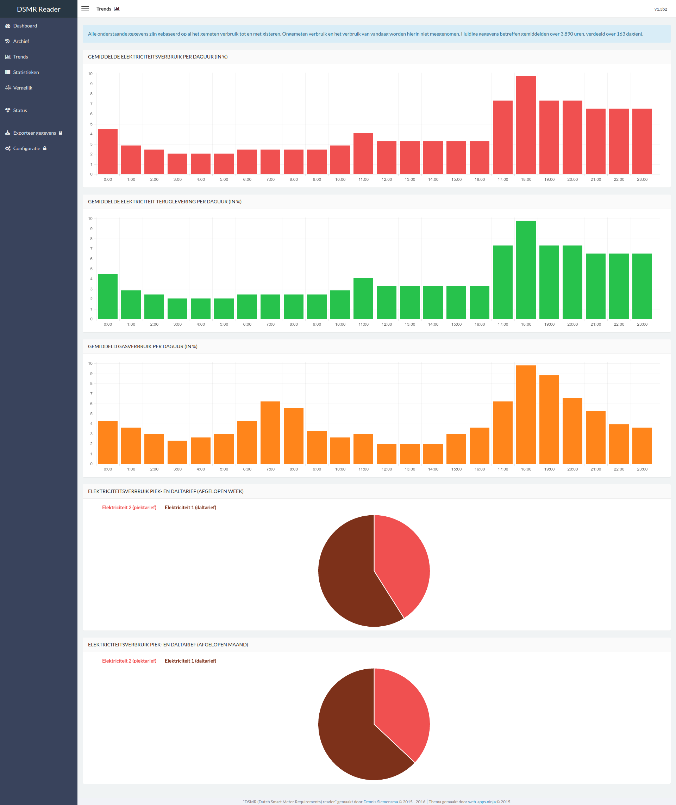
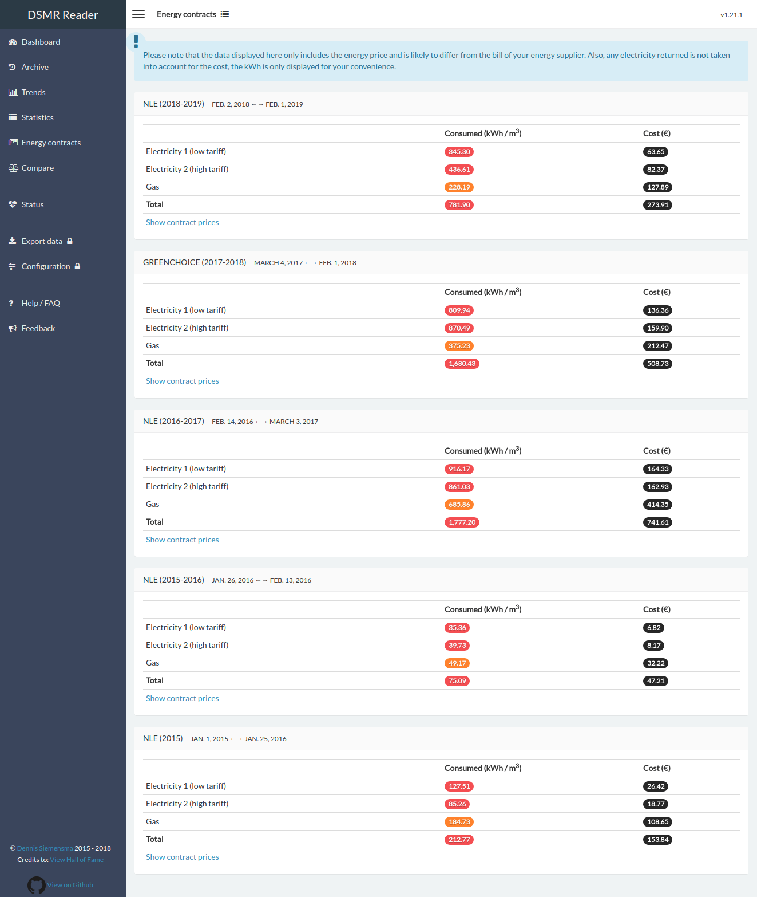

# DSMR Reader Datalogger/GUI

## Documentation (`English` & `Nederlands`)
- `English`: See [Read The Docs, in English](https://dsmr-reader.readthedocs.io/en/latest/). Installation guide can be found there as well.
- `Nederlands`: Zie [Read The Docs, in het Nederlands](https://dsmr-reader.readthedocs.io/nl/latest/). Je kunt daar ook alle installatieinstructies vinden.

## Project mission
- **Always free to use** (for non-commercial use only).
- **Keeping your data for yourself** (none of the data is stored outside your database, unless you explicitly upload it to a third party).

## Features
- Application languages supported: **Dutch (Nederlands)**  and **English**. The language used in your browser dynamicly decides the language applied in the application.
- Optional Support for **exporting data to third-parties**: MinderGas.nl, PVOutput.org.
- Also supports local exports: CSV, SQL back-ups & optional daily upload to Dropbox.
- Notifications on your devices, supporting **Pushover** and **Prowl** apps!
- Optional data rotation/retention, keeping your dataset small and portable.
- Compare two days, months or years with each other.
- REST API to either insert or read data realtime.
- Keep track of certain events by sticking your own notes to a day, reminding yourself what happened that day.
- Support for MQTT export.
- Extendable plug-in system.
- Scrollable graphs.

### Dashboard

### Archive

### Trends

### Energy contracts

## Screenshots
More screenshots can be found in the documentation at [Read The Docs](https://dsmr-reader.readthedocs.io/en/latest/screenshots.html).
