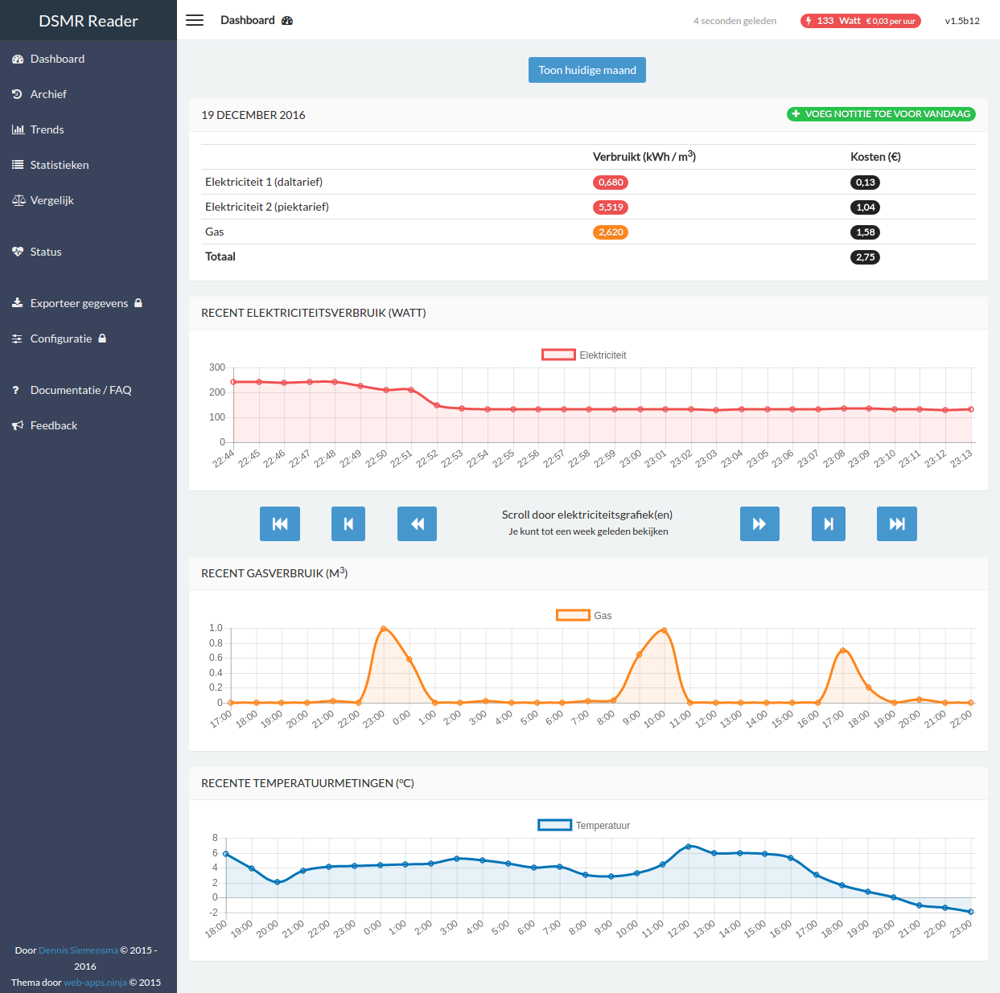
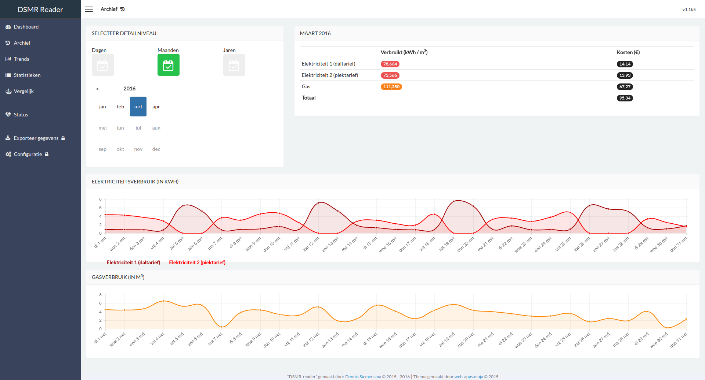
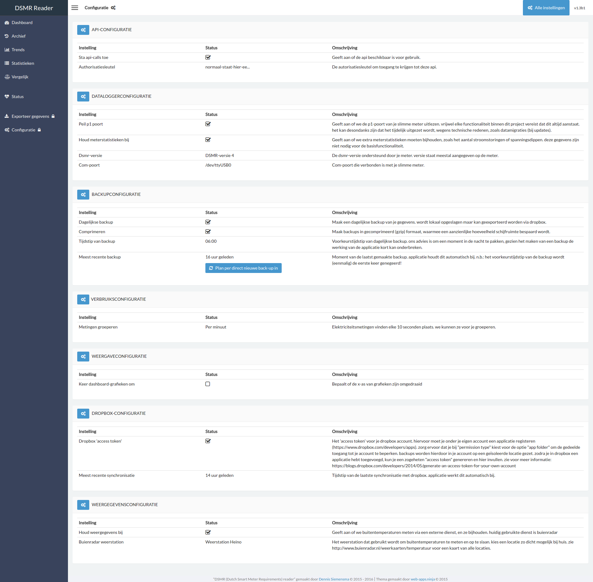

# About
There are plenty of ‘scripts’ and websites available for performing DSMR readings. This project however is a full stack solution and allows you to keep your own data for yourself, on your own RaspberryPi.

# Documentation

**English**

See [Read The Docs, in English](http://dsmr-reader.readthedocs.io/en/latest/). Installation guide can be found there as well.

**Dutch / Nederlands**

Zie [Read The Docs, in het Nederlands](http://dsmr-reader.readthedocs.io/nl/latest/). Je kunt daar ook alle installatieinstructies vinden.

# Screenshots
More screenshots can be found in the documentation at [Read The Docs](http://dsmr-reader.readthedocs.io/en/latest/screenshots.html).

## Dashboard

## Archive

## Configuration

