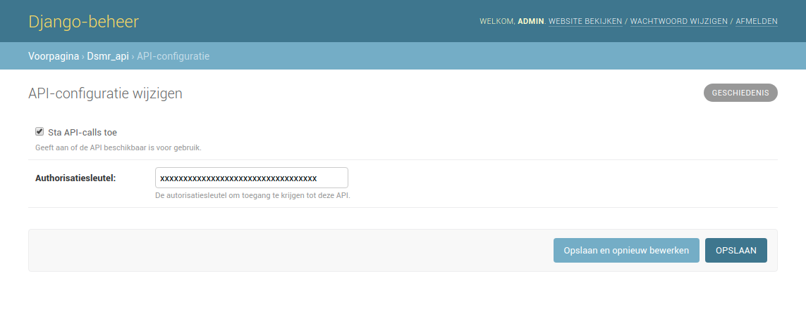

Admin: API
==========

Configure the API if you need it to supply telegrams or simply read data from DSMR-reader.

By default a random API key will be generated. You can enter your own if you want to.
:doc:`You can find the API documentation here.<../api>`

