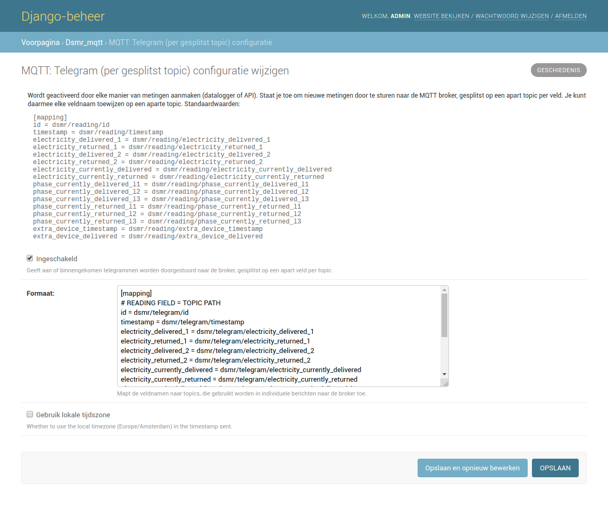

Admin: MQTT
===========

The application has native support for MQTT.
In the screen below you can enter all information about the broker you're using.

There are options for using different ports, SSL, authentication and even the Quality of Service (QoS) used.
More information about MQTT QoS `can be found here <https://www.hivemq.com/blog/mqtt-essentials-part-6-mqtt-quality-of-service-levels>`_.

.. image:: ../_static/screenshots/v4/admin/mqttbrokersettings.png
    :target: ../_static/screenshots/v4/admin/mqttbrokersettings.png
    :alt: MQTT Broker

There are multiple configurations available for sending MQTT messages to your broker.
You can enable them seperately, depending on your needs.
Many of these also allow you to define which fields are sent and how they should be identified in messages sent to the broker.

Day totals
----------

This allows you to receive the day totals in JSON format:

.. image:: ../_static/screenshots/v4/admin/jsondaytotalsmqttsettings.png
    :target: ../_static/screenshots/v4/admin/jsondaytotalsmqttsettings.png
    :alt: MQTT JSON day Totals

The same data, but splitted among topics. This allows you to post a single piece of data on a separate topic:

.. image:: ../_static/screenshots/v4/admin/splittopicdaytotalsmqttsettings.png
    :target: ../_static/screenshots/v4/admin/splittopicdaytotalsmqttsettings.png
    :alt: MQTT Split Topic Day Totals

Meter statistics
----------------

Statistics of your meter, splitted among topics:

.. image:: ../_static/screenshots/v4/admin/splittopicmeterstatisticsmqttsettings.png
    :target: ../_static/screenshots/v4/admin/splittopicmeterstatisticsmqttsettings.png
    :alt: MQTT Split Topic Meter Statistics

Telegram
--------

Telegram in JSON format:

.. image:: ../_static/screenshots/v4/admin/jsontelegrammqttsettings.png
    :target: ../_static/screenshots/v4/admin/jsontelegrammqttsettings.png
    :alt: MQTT JSON Telegram

Or splitted among topics:

Or in raw DSMR protocol format (when available):

.. image:: ../_static/screenshots/v4/admin/rawtelegrammqttsettings.png
    :target: ../_static/screenshots/v4/admin/rawtelegrammqttsettings.png
    :alt: MQTT Raw Telegram
