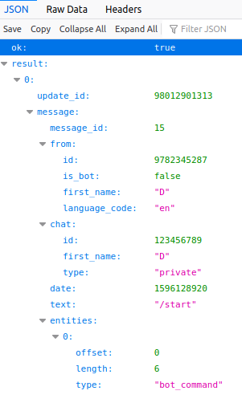

Admin: Notifications
====================

.. contents::
    :depth: 2

Notifications on your phone using Prowl, Pushover or Telegram.

.. image:: ../_static/screenshots/v4/admin/notificationsetting.png
    :target: ../_static/screenshots/v4/admin/notificationsetting.png
    :alt: Notifications

Currently, two mobile platforms are supported: Android and iOS.

* The supported apps for Android are `Pushover <https://pushover.net>`_ and `Telegram <https://www.telegram.org>`_. 
* The supported apps for iOS are `Pushover <https://pushover.net>`_, `Prowl <https://www.prowlapp.com>`_ and `Telegram <https://www.telegram.org>`_. 

Make sure you either have Pushover, Prowl or Telegram installed on your smartphone. 
If you don't, visit your platforms app store to download the app and sign up for an account. 
Then, make sure to get your API key from the notification service that you prefer. 
For instruction on obtaining the API key, please read below.

In the DSMR-reader **Notifications Apps** settings, select the notification service you want to use. 
Copy the API key from the notification service and paste in into the the textbox for the API key. 
When you save these settings, your first notification should be sent after midnight. 
Don't worry about nightly alerts, the notifications will be sent with low priority and should not wake you up.

Pushover: How do I obtain my API key?
~~~~~~~~~~~~~~~~~~~~~~~~~~~~~~~~~~~~~

After you have downloaded Pushover and signed up for an account you should be able to `login into your Pushover account <https://pushover.net>`_. 

You should see an overview of containing **Your User Key** (top right) and Applications, if you have any. 
To create an application in Pushover, for sending notifications to your phone, please click **Create an Application/API Token**.

Pushover requires you to enter two keys in DSMR-reader. 

* You will need the **User Key** displayed on the top right in the screenshot below. 
* And you will need the **API key** for the application you've created in Pushover.

.. image:: ../_static/faq/notifications-pushover-get-key.png
    :target: ../_static/faq/notifications-pushover-get-key.png
    :alt: Pushover Get Your API Key

Prowl: How do I obtain my API key?
~~~~~~~~~~~~~~~~~~~~~~~~~~~~~~~~~~

After you have downloaded Prowl and signed up for an account you should be able to `login into your Prowl account <https://www.prowlapp.com/login.php>`_. 

Now go to "`API Keys <https://www.prowlapp.com/api_settings.php>`_", you should see an overview of your current API keys if you have any. 
To create an API key for the DSMR-reader, input a name and click **"Generate Key"**.

.. image:: ../_static/faq/notifications-prowl-create-key.png
    :target: ../_static/faq/notifications-prowl-key.png
    :alt: Prowl My Account overview
    
When a new key is generated, you will see it immediatly. Your key is listed like in the screenshot below (the red box marks your API key).

.. image:: ../_static/faq/notifications-prowl-get-key.png
    :target: ../_static/faq/notifications-prowl-get-key.png
    :alt: Prowl Get Your API Key

Telegram: How do I obtain my API key?
~~~~~~~~~~~~~~~~~~~~~~~~~~~~~~~~~~~~~

Please note that you can only use these notifications if you have your own (chat) bot with Telegram.

More information about bots `can be found here <https://core.telegram.org/bots>`_. You will need the API key provided to you by the ``BotFather`` bot.

Telegram: How do I obtain the Chat ID?
~~~~~~~~~~~~~~~~~~~~~~~~~~~~~~~~~~~~~~

You will also need the Chat ID to have the bot send messages to the right chat.
**By default bots are not allowed to contact anyone by themselves or see messages in a group.**

So first make sure to send a message directly to the bot as human.
Or, if you added the bot in a group, make sure it has permissions to read messages in the group and then send a message in the group accordingly.

Any message the bot receives (or is allowed to see) is sent as update to the bot.
You can use the Telegram API in your browser to see the updates for your bot.
It will contain the Chat ID you're looking for.

Construct the following URL::

    https://api.telegram.org/bot<APIkey>/getUpdates?offset=-1

For example when using the fake API key ``1268827887:ABCDEFGqdtsgtts-JDASIJDqewqkqewaq``::

    https://api.telegram.org/bot1268827887:ABCDEFGqdtsgtts-JDASIJDqewqkqewaq/getUpdates?offset=-1

You should see something similar to:

Extract the Chat ID from the response. In the example above it's ``123456789``.
You can use that ID in the Telegram notifications config of DSMR-reader.

To test notifications, you can execute the following command::

    sudo su - dsmr
    ./manage.py dsmr_notification_test

Please note that DSMR-reader will reset and wipe notification settings on any error. This can be experienced as a bit annoying.
