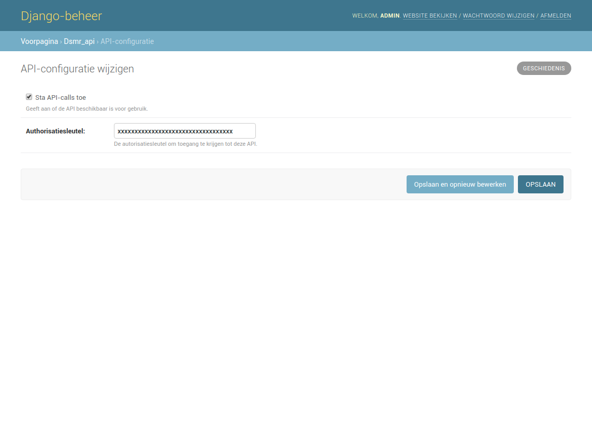

DSMR-reader API
===============
The application has an API allowing you to insert/create readings and retrieve statistics.

.. contents::

Configuration
-------------

Enable API
^^^^^^^^^^

The API is disabled by default in the application. You may enable it in your configuration or admin settings.

Documentation
-------------

.. warning::

    The API-documentation has been moved to your local DSMR-reader installation since DSMR-reader ``v3.1``.

    You can access it by selecting the ``API docs`` menu item in DSMR-reader ``v3.1+``.
