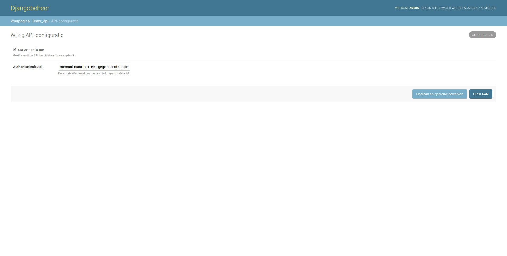

API
===
The application has an API allowing you to insert/create readings and retrieve statistics.

.. contents::

Configuration & authentication
------------------------------

Enable API
^^^^^^^^^^

The API is disabled by default in the application. You may enable it in your configuration or admin settings.

Example
~~~~~~~

Authenticating
^^^^^^^^^^^^^^
Besides allowing the API to listen for requests, you will also need send your API key with each request. 
The API key can be found on the same page as in the screenshot above.
The application generates one for you initially, but feel free to alter the API key when required.

You should pass it in the header of every API call. The header should be defined as ``X-AUTHKEY``. See below for an example. 

Examples
~~~~~~~~

Using ``cURL``::

   curl http://YOUR-DSMR-URL/api/v1/datalogger/dsmrreading \
        -d 'telegram=xxxxx' \
        -H 'X-AUTHKEY: YOUR-API-KEY'
        
Using ``requests``::

   requests.post(
        'http://YOUR-DSMR-URL/api/v1/datalogger/dsmrreading',
        headers={'X-AUTHKEY': 'YOUR-API-KEY'},
        data={'telegram': 'xxxxx'},
    )

[API v1] Remote datalogger
--------------------------

``POST`` - ``datalogger/dsmrreading``
^^^^^^^^^^^^^^^^^^^^^^^^^^^^^^^^^^^^^

This allows you to insert a raw telegram, into the application as if it was read locally using the serial cable.

.. note::

    Since ``DSMR-reader v1.6`` this call now returns ``HTTP 201`` instead of ``HTTP 200`` when successful.

URI
~~~
Full path: ``/api/v1/datalogger/dsmrreading``

Parameters
~~~~~~~~~~

- ``telegram`` (*string*) - The raw telegram string containing all linefeeds ``\n``, and carriage returns ``\r``, as well!

Response
~~~~~~~~
``HTTP 201`` on success, with empty body. Any other status code on failure.

Example
~~~~~~~

(using the ``requests`` library available on PIP)::

    import requests  # Tested with requests==2.9.1

    telegram_string = ''.join([
        "/KFM5KAIFA-METER\r\n",
        "\r\n",
        "1-3:0.2.8(42)\r\n",
        "0-0:1.0.0(160303164347W)\r\n",
        "0-0:96.1.1(*******************************)\r\n",
        "1-0:1.8.1(001073.079*kWh)\r\n",
        "1-0:1.8.2(001263.199*kWh)\r\n",
        "1-0:2.8.1(000000.000*kWh)\r\n",
        "1-0:2.8.2(000000.000*kWh)\r\n",
        "0-0:96.14.0(0002)\r\n",
        "1-0:1.7.0(00.143*kW)\r\n",
        "1-0:2.7.0(00.000*kW)\r\n",
        "0-0:96.7.21(00006)\r\n",
        "0-0:96.7.9(00003)\r\n",
        "1-0:99.97.0(1)(0-0:96.7.19)(000101000001W)(2147483647*s)\r\n",
        "1-0:32.32.0(00000)\r\n",
        "1-0:32.36.0(00000)\r\n",
        "0-0:96.13.1()\r\n",
        "0-0:96.13.0()\r\n",
        "1-0:31.7.0(000*A)\r\n",
        "1-0:21.7.0(00.143*kW)\r\n",
        "1-0:22.7.0(00.000*kW)\r\n",
        "!74B0\n",
    ])

    # Register telegram by simply sending it to the application with a POST request.
    response = requests.post(
        'http://YOUR-DSMR-URL/api/v1/datalogger/dsmrreading',
        headers={'X-AUTHKEY': 'YOUR-API-KEY'},
        data={'telegram': telegram_string},
    )

    # You will receive a status 201 when successful.
    if response.status_code != 201:
        # Or you will find the error (hint) in the reponse body on failure.
        print('Error: {}'.format(response.text))

Script
~~~~~~
Below is a more detailed script you can use to run via Supervisor. It will send telegrams to one or multiple instances of DSMR-reader.

.. note::

    You will still require the ``dsmr`` user and VirtualEnv, :doc:`as discussed in the install guide<installation>` in **chapters 3 and 6**!

**VirtualEnv**::

    sudo su - dsmr
    pip install pyserial==3.2.1
    pip install requests==2.12.4

.. note::

    The serial connection in this example is based on ``DSMR v4``.
    
.. warning::

    Don't forget to insert your own configuration below in ``API_SERVERS``.

Client file in ``/home/dsmr/dsmr_datalogger_api_client.py``::

    from time import sleep

    from serial.serialutil import SerialException
    import requests
    import serial

    API_SERVERS = (
        ('http://HOST-OR-IP-ONE/api/v1/datalogger/dsmrreading', 'APIKEY-BLABLABLA-ABCDEFGHI'),
    ###    ('http://HOST-OR-IP-TWO/api/v1/datalogger/dsmrreading', 'APIKEY-BLABLABLA-JKLMNOPQR'),
    )

    def main():
        print ('Starting...')

        for telegram in read_telegram():
            print('Telegram read')
            print(telegram)

            for current_server in API_SERVERS:
                api_url, api_key = current_server

                print('Sending telegram to:', api_url)
                send_telegram(telegram, api_url, api_key)

            sleep(1)

    def read_telegram():
        """ Reads the serial port until we can create a reading point. """
        serial_handle = serial.Serial()
        serial_handle.port = '/dev/ttyUSB0'
        serial_handle.baudrate = 115200
        serial_handle.bytesize = serial.EIGHTBITS
        serial_handle.parity = serial.PARITY_NONE
        serial_handle.stopbits = serial.STOPBITS_ONE
        serial_handle.xonxoff = 1
        serial_handle.rtscts = 0
        serial_handle.timeout = 20

        # This might fail, but nothing we can do so just let it crash.
        serial_handle.open()

        telegram_start_seen = False
        buffer = ''

        # Just keep fetching data until we got what we were looking for.
        while True:
            try:
                data = serial_handle.readline()
            except SerialException as error:
                # Something else and unexpected failed.
                print('Serial connection failed:', error)
                raise StopIteration()  # Break out of yield.

            try:
                # Make sure weird characters are converted properly.
                data = str(data, 'utf-8')
            except TypeError:
                pass

            # This guarantees we will only parse complete telegrams. (issue #74)
            if data.startswith('/'):
                telegram_start_seen = True

                # But make sure to RESET any data collected as well! (issue #212)
                buffer = ''

            # Delay any logging until we've seen the start of a telegram.
            if telegram_start_seen:
                buffer += data

            # Telegrams ends with '!' AND we saw the start. We should have a complete telegram now.
            if data.startswith('!') and telegram_start_seen:
                yield buffer

                # Reset the flow again.
                telegram_start_seen = False
                buffer = ''

    def send_telegram(telegram, api_url, api_key):
        # Register telegram by simply sending it to the application with a POST request.
        response = requests.post(
            api_url,
            headers={'X-AUTHKEY': api_key},
            data={'telegram': telegram},
        )

        # Old versions of DSMR-reader return 200, new ones 201.
        if response.status_code not in (200, 201):
            # Or you will find the error (hint) in the reponse body on failure.
            print('API error: {}'.format(response.text))

    if __name__ == '__main__':
        main()

Supervisor config in ``/etc/supervisor/conf.d/dsmr-client.conf``::

    [program:dsmr_client_datalogger]
    command=/usr/bin/nice -n 5 /home/dsmr/.virtualenvs/dsmrreader/bin/python3 -u /home/dsmr/dsmr_datalogger_api_client.py
    pidfile=/var/tmp/dsmrreader--%(program_name)s.pid
    user=dsmr
    group=dsmr
    autostart=true
    autorestart=true
    startsecs=1
    startretries=100
    stopwaitsecs=20
    stdout_logfile=/var/log/supervisor/%(program_name)s.log
    stdout_logfile_maxbytes=10MB
    stdout_logfile_backups=3

**Supervisor**::

    sudo supervisorctl reread
    sudo supervisorctl update 

----
    

[API v2] RESTful API
--------------------

.. note::

    These API calls are available since ``v1.7``.

``POST`` - ``datalogger/dsmrreading``
^^^^^^^^^^^^^^^^^^^^^^^^^^^^^^^^^^^^^

Creates a reading from direct values, omitting the need for the telegram. 

.. note::

    **Please note**: Readings are processed simultaneously. Inserting readings **retroactively** might result in undesired results due to the data processing, which is always reading ahead.
    
    Therefor inserting historic data might require you to delete all aggregated data using the ``./manage.py dsmr_backend_delete_aggregated_data`` command.
    
    This will process all readings again, from the very first start, and aggregate them (and **will** take a long time depending on your reading count).
    
    Please note that the datalogger may interfere. If your stats are not correctly after regenerating, try it again while having your datalogger disabled.

URI
~~~
Full path: ``/api/v2/datalogger/dsmrreading``

Parameters
~~~~~~~~~~
**[R]** = Required field

- **[R]** ``timestamp`` (*datetime*) - Timestamp indicating when the reading was taken, according to the smart meter
- **[R]** ``electricity_currently_delivered`` (*float*) - Current electricity delivered in kW
- **[R]** ``electricity_currently_returned`` (*float*) - Current electricity returned in kW
- **[R]** ``electricity_delivered_1`` (*float*) - Meter position stating electricity delivered (low tariff) in kWh
- **[R]** ``electricity_delivered_2`` (*float*) - Meter position stating electricity delivered (normal tariff) in kWh
- **[R]** ``electricity_returned_1`` (*float*) - Meter position stating electricity returned (low tariff) in kWh
- **[R]** ``electricity_returned_2`` (*float*) - Meter position stating electricity returned (normal tariff) in kWh
- ``phase_currently_delivered_l1`` (*float*) - Current electricity used by phase L1 (in kW)
- ``phase_currently_delivered_l2`` (*float*) - Current electricity used by phase L2 (in kW)
- ``phase_currently_delivered_l3`` (*float*) - Current electricity used by phase L3 (in kW)
- ``extra_device_timestamp`` (*datetime*) - Last timestamp read from the extra device connected (gas meter)
- ``extra_device_delivered`` (*float*) - Last value read from the extra device connected (gas meter)

.. note::

    **datetime format** = ``YYYY-MM-DDThh:mm[:ss][+HH:MM|-HH:MM|Z]``, i.e.: ``2017-01-01T12:00:00+01`` (CET), ``2017-04-15T12:00:00+02`` (CEST) or ``2017-04-15T100:00:00Z`` (UTC).

Response
~~~~~~~~
``HTTP 201`` on success. Body contains the reading created in JSON format. Any other status code on failure.

Example
~~~~~~~
**Data** to insert::

    electricity_currently_delivered: 1.500
    electricity_currently_returned: 0.025
    electricity_delivered_1: 2000
    electricity_delivered_2: 3000
    electricity_returned_1: 0
    electricity_returned_2: 0
    timestamp: 2017-04-15T00:00:00+02

Using **cURL** (commandline)::

    # Please note that the plus symbol "+" has been replaced by "%2B" here, to make it work for cURL.
    curl http://YOUR-DSMR-URL/api/v2/datalogger/dsmrreading \
          -d 'timestamp=2017-04-15T00:00:00%2B02&electricity_currently_delivered=1.5&electricity_currently_returned=0.025&electricity_delivered_1=2000&electricity_delivered_2=3000&electricity_returned_1=0&electricity_returned_2=0' \
          -H 'X-AUTHKEY: YOUR-API-KEY' | python -m json.tool

Using **requests** (Python)::

    import requests
    import json

    response = requests.post(
        'http://YOUR-DSMR-URL/api/v2/datalogger/dsmrreading',
        headers={'X-AUTHKEY': 'YOUR-API-KEY'},
        data={
            'electricity_currently_delivered': 1.500,
            'electricity_currently_returned': 0.025,
            'electricity_delivered_1': 2000,
            'electricity_delivered_2': 3000,
            'electricity_returned_1': 0,
            'electricity_returned_2': 0,
            'timestamp': '2017-04-15T00:00:00+02',
        }
    )

    if response.status_code != 201:
        print('Error: {}'.format(response.text))
    else:
        print('Created: {}'.format(json.loads(response.text)))

          
**Result**::

    {
        "id": 4343119,
        "timestamp": "2017-04-15T00:00:00+02:00",
        "electricity_delivered_1": "2000.000",
        "electricity_returned_1": "0.000",
        "electricity_delivered_2": "3000.000",
        "electricity_returned_2": "0.000",
        "electricity_currently_delivered": "1.500",
        "electricity_currently_returned": "0.025",
        "phase_currently_delivered_l1": null,
        "phase_currently_delivered_l2": null,
        "phase_currently_delivered_l3": null,
        "extra_device_timestamp": null,
        "extra_device_delivered": null
    }
    
    
----
    

``GET`` - ``datalogger/dsmrreading``
^^^^^^^^^^^^^^^^^^^^^^^^^^^^^^^^^^^^

Retrieves any readings stored. The readings are either constructed from incoming telegrams or were created using this API.

URI
~~~
Full path: ``/api/v2/datalogger/dsmrreading``

Parameters
~~~~~~~~~~
All parameters are optional.

- ``timestamp__gte`` (*datetime*) - Limits the result to any readings having a timestamp **higher or equal** to this parameter.
- ``timestamp__lte`` (*datetime*) - Limits the result to any readings having a timestamp **lower or equal** to this parameter.
- ``ordering`` (*string*) - Use ``-timestamp`` to sort **descending**. Omit or use ``timestamp`` to sort **ascending** (default).
- ``offset`` (*integer*) - When iterating large resultsets, the offset determines the starting point.
- ``limit`` (*integer*) - Limits the resultset size returned. Omit for maintaining the default limit (**25**).

Response
~~~~~~~~
``HTTP 200`` on success. Body contains the result(s) in JSON format. Any other status code on failure.

.. _generic-examples-anchor:

Example 1 - Fetch all readings
~~~~~~~~~~~~~~~~~~~~~~~~~~~~~~
This demonstrates how to fetch all readings stored, without using any of the parameters. 

Using **cURL** (commandline)::

 curl 'http://YOUR-DSMR-URL/api/v2/datalogger/dsmrreading' \
      -H 'X-AUTHKEY: YOUR-API-KEY' | python -m json.tool

Using **requests** (Python)::

    import requests
    import json

    response = requests.get(
        'http://YOUR-DSMR-URL/api/v2/datalogger/dsmrreading',
        headers={'X-AUTHKEY': 'YOUR-API-KEY'},
    )

    if response.status_code != 200:
        print('Error: {}'.format(response.text))
    else:
        print('Response: {}'.format(json.loads(response.text)))

**Result**::

    # Please note that by default only 25 results are returned. The actual number of results
    # is available in the 'count' field. You can iterate these using the offset-parameter.    
    {
        "count": 4343060,
        "next": "http://YOUR-DSMR-URL/api/v2/datalogger/dsmrreading?limit=25&offset=25",
        "previous": null,
        "results": [
            {
                "id": 1,
                "timestamp": "2015-12-11T21:25:05Z",
                "electricity_delivered_1": "594.560",
                "electricity_returned_1": "0.000",
                "electricity_delivered_2": "593.006",
                "electricity_returned_2": "0.000",
                "electricity_currently_delivered": "0.183",
                "electricity_currently_returned": "0.000",
                "phase_currently_delivered_l1": null,
                "phase_currently_delivered_l2": null,
                "phase_currently_delivered_l3": null,
                "extra_device_timestamp": "2015-12-11T21:00:00Z",
                "extra_device_delivered": "956.212"
            },
            ... <MORE RESULTS> ...
        ]
    }
    

Example 2 - Fetch latest reading
~~~~~~~~~~~~~~~~~~~~~~~~~~~~~~~~
This demonstrates how to fetch the latest reading stored. Therefor we request all readings, sort them descending by timestamp and limit the result to only one.

Using **cURL** (commandline)::

    curl 'http://YOUR-DSMR-URL/api/v2/datalogger/dsmrreading?ordering=-timestamp&limit=1' \
        -H 'X-AUTHKEY: YOUR-API-KEY' | python -m json.tool

Using **requests** (Python)::

    import requests
    import json

    response = requests.get(
        'http://YOUR-DSMR-URL/api/v2/datalogger/dsmrreading?ordering=-timestamp&limit=1',
        headers={'X-AUTHKEY': 'YOUR-API-KEY'},
    )

    if response.status_code != 200:
        print('Error: {}'.format(response.text))
    else:
        print('Response: {}'.format(json.loads(response.text)))

**Result**::

    # This should present you the latest reading (determined by the timestamp field)
    {
        "count": 4343060,
        "next": "http://YOUR-DSMR-URL/api/v2/datalogger/dsmrreading?limit=1&offset=1&ordering=-timestamp",
        "previous": null,
        "results": [
            {
                "id": 4343116,
                "timestamp": "2017-04-29T03:59:25Z",
                "electricity_delivered_1": "1871.589",
                "electricity_returned_1": "0.000",
                "electricity_delivered_2": "1756.704",
                "electricity_returned_2": "0.000",
                "electricity_currently_delivered": "0.078",
                "electricity_currently_returned": "0.000",
                "phase_currently_delivered_l1": "0.024",
                "phase_currently_delivered_l2": "0.054",
                "phase_currently_delivered_l3": "0.000",
                "extra_device_timestamp": "2017-04-29T03:00:00Z",
                "extra_device_delivered": "1971.929"
            }
        ]
    }

Example 3 - Fetch readings by month
~~~~~~~~~~~~~~~~~~~~~~~~~~~~~~~~~~~
This demonstrates how to fetch all readings within a month. We limit the search by specifying the month start and end.

Using **cURL** (commandline)::

    # Note that the whitespace in the timestamps has been converted to '%20' for cURL.
    curl 'http://YOUR-DSMR-URL/api/v2/datalogger/dsmrreading?timestamp__gte=2017-02-01%2000:00:00&timestamp__lte=2017-03-01%2000:00:00' \
        -H 'X-AUTHKEY: YOUR-API-KEY' | python -m json.tool

Using **requests** (Python)::

    import requests
    import json

    response = requests.get(
        'http://YOUR-DSMR-URL/api/v2/statistics/day?timestamp__gte=2017-02-01 00:00:00&timestamp__lte=2017-03-01 00:00:00',
        headers={'X-AUTHKEY': 'YOUR-API-KEY'},
    )

    if response.status_code != 200:
        print('Error: {}'.format(response.text))
    else:
        print('Response: {}'.format(json.loads(response.text)))
        
        
**Result**::

    # This should present you a set of all readings in the month we selected.
    {
        "count": 240968,
        "next": "http://YOUR-DSMR-URL/api/v2/datalogger/dsmrreading?limit=25&offset=25&timestamp__gte=2017-02-01+00%3A00%3A00&timestamp__lte=2017-03-01+00%3A00%3A00",
        "previous": null,
        "results": [
            {
                "id": 3593621,
                "timestamp": "2017-01-31T23:00:03Z",
                "electricity_delivered_1": "1596.234",
                "electricity_returned_1": "0.000",
                "electricity_delivered_2": "1484.761",
                "electricity_returned_2": "0.000",
                "electricity_currently_delivered": "0.075",
                "electricity_currently_returned": "0.000",
                "phase_currently_delivered_l1": "0.017",
                "phase_currently_delivered_l2": "0.058",
                "phase_currently_delivered_l3": "0.000",
                "extra_device_timestamp": "2017-01-31T22:00:00Z",
                "extra_device_delivered": "1835.904"
            },
            ... <MORE RESULTS> ...
        ]
    }
    
    
.. warning::

    Please note that all timestamps **returned** are in **UTC (CET -1 / CEST -2)**. This is indicated as well by the timestamps ending with a 'Z' (Zulu timezone).

    
----
    

``GET`` - ``consumption/today``
^^^^^^^^^^^^^^^^^^^^^^^^^^^^^^^
Returns the consumption of the current day so far.

URI
~~~
Full path: ``/api/v2/consumption/today``

Parameters
~~~~~~~~~~
None.

Response
~~~~~~~~
``HTTP 200`` on success. Body contains the result(s) in JSON format. Any other status code on failure.

Example
~~~~~~~

**Data structure returned**::

    {
        "day": "2017-09-28",
        "electricity1": 0.716,
        "electricity1_cost": 0.12,
        "electricity1_returned": 0,
        "electricity2": 3.403,
        "electricity2_cost": 0.63,
        "electricity2_returned": 0,
        "gas": 0.253,
        "gas_cost": 0.15,
        "total_cost": 0.9,
    }

----
    
    
``GET`` - ``statistics/hour``
^^^^^^^^^^^^^^^^^^^^^^^^^^^^^
Retrieves any **aggregated hourly statistics**. Please note that these are generated a few hours **after midnight**.

    
----
    

``GET`` - ``statistics/day``
^^^^^^^^^^^^^^^^^^^^^^^^^^^^
Retrieves any **aggregated day statistics**. Please note that these are generated a few hours **after midnight**.

URI
~~~
Full path: ``/api/v2/statistics/day``

Parameters
~~~~~~~~~~
All parameters are optional.

- ``day__gte`` (*date*) - Limits the result to any statistics having their date **higher or equal** to this parameter.
- ``day__lte`` (*date*) - Limits the result to any statistics having their date **lower or equal** to this parameter.
- ``ordering`` (*string*) - Use ``-day`` to sort **descending**. Omit or use ``day`` to sort **ascending** (default).
- ``offset`` (*integer*) - When iterating large resultsets, the offset determines the starting point.
- ``limit`` (*integer*) - Limits the resultset size returned. Omit for maintaining the default limit (**25**).

Response
~~~~~~~~
``HTTP 200`` on success. Body contains the result(s) in JSON format. Any other status code on failure.

Example
~~~~~~~
All the :ref:`generic DSMRREADING examples <generic-examples-anchor>` apply here as well, since only the ``timestamp`` field differs.

**Data structure returned**::

    {
        "count": 29,
        "next": "http://YOUR-DSMR-URL/api/v2/statistics/day?day__gte=2017-02-01&day__lte=2017-03-01&limit=25&offset=25",
        "previous": null,
        "results": [
            {
                "id": 709,
                "day": "2017-02-25",
                "total_cost": "3.14",
                "electricity1": "7.289",
                "electricity2": "0.000",
                "electricity1_returned": "0.000",
                "electricity2_returned": "0.000",
                "electricity1_cost": "1.30",
                "electricity2_cost": "0.00",
                "gas": "3.047",
                "gas_cost": "1.84",
                "lowest_temperature": "0.6",
                "highest_temperature": "7.9",
                "average_temperature": "4.3"
            }
        ]
    }

----
    
    
``GET`` - ``statistics/hour``
^^^^^^^^^^^^^^^^^^^^^^^^^^^^^
Retrieves any **aggregated hourly statistics**. Please note that these are generated a few hours **after midnight**.

URI
~~~
Full path: ``/api/v2/statistics/hour``

Parameters
~~~~~~~~~~
All parameters are optional.

- ``hour_start__gte`` (*datetime*) - Limits the result to any statistics having their datetime (hour start) **higher or equal** to this parameter.
- ``hour_start__lte`` (*datetime*) - Limits the result to any statistics having their datetime (hour start) **lower or equal** to this parameter.
- ``ordering`` (*string*) - Use ``-hour_start`` to sort **descending**. Omit or use ``hour_start`` to sort **ascending** (default).
- ``offset`` (*integer*) - When iterating large resultsets, the offset determines the starting point.
- ``limit`` (*integer*) - Limits the resultset size returned. Omit for maintaining the default limit (**25**).

Response
~~~~~~~~
``HTTP 200`` on success. Body contains the result(s) in JSON format. Any other status code on failure.

Example
~~~~~~~
All the :ref:`generic DSMRREADING examples <generic-examples-anchor>` apply here as well, since only the ``timestamp`` field differs.

**Data structure returned**::

    {
        "count": 673,
        "next": "http://YOUR-DSMR-URL/api/v2/statistics/hour?hour_start__gte=2017-02-01+00%3A00%3A00&hour_start__lte=2017-03-01+00%3A00%3A00&limit=25&offset=25",
        "previous": null,
        "results": [
            {
                "id": 12917,
                "hour_start": "2017-02-01T23:00:00Z",
                "electricity1": "0.209",
                "electricity2": "0.000",
                "electricity1_returned": "0.000",
                "electricity2_returned": "0.000",
                "gas": "0.886"
            }
        ]
    }

