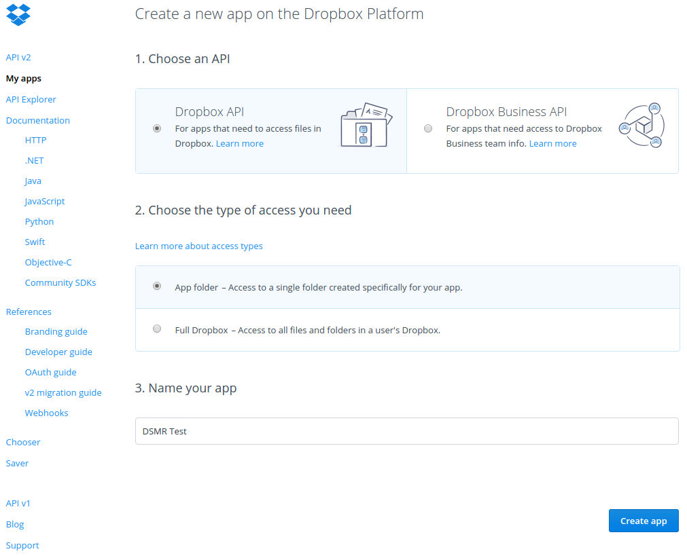
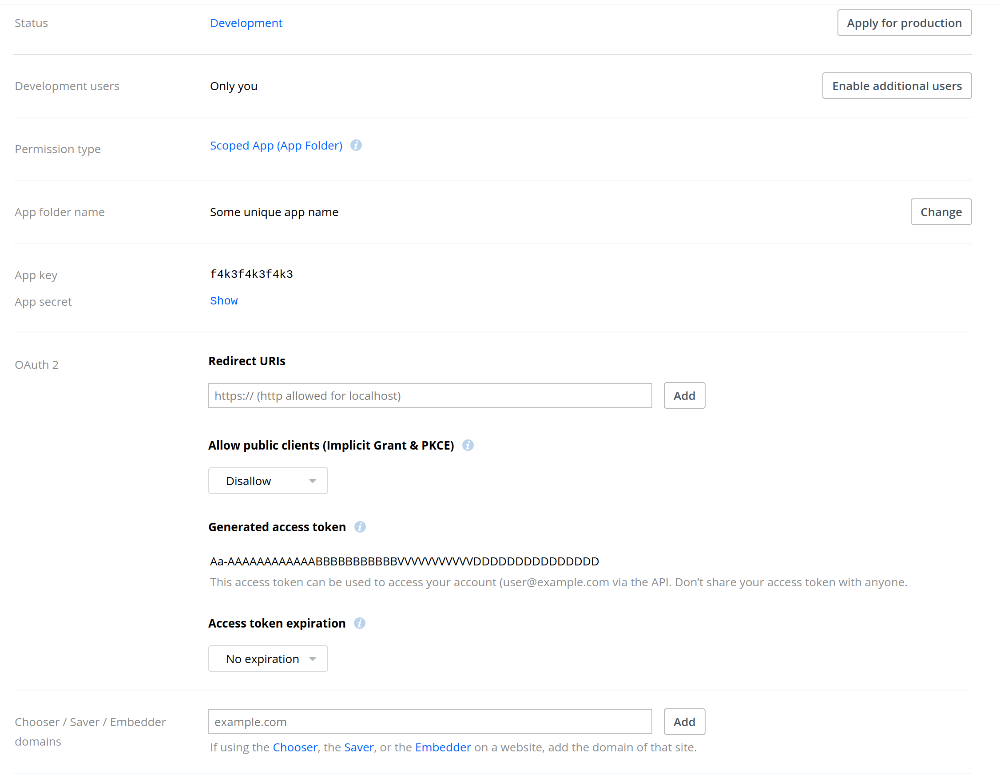

Integration: Dropbox
====================

.. contents::
    :depth: 2

Dropbox: Automated backup sync
------------------------------
*How can I link my Dropbox account for backups?*

Make sure you have a Dropbox-account or sign up for one. 
Now go to `Dropbox Apps <https://www.dropbox.com/developers/apps>`_ and click **"Create app"** in top right corner.

.. image:: _static/faq/dropbox_apps_overview.png
    :target: _static/faq/dropbox_apps_overview.png
    :alt: Dropbox Apps

Choose the following options: (1) **Dropbox API** and (2) **App folder**. 
Then enter a name for your app (3), this will also be used as directory name within the Apps-folder of your Dropbox. 

The app should be created in developer-mode. You can generate an access token for yourself by clicking the **"Generate"** button somewhere below.
    

    
Copy the generated access token to the DSMR-reader settings for the Dropbox-configuration. The DSMR-reader application should sync any backups created shortly.
