About DSMR-reader
#################

.. contents::
    :depth: 3

Project goals
-------------
- Provide a tool to easily extract, store and visualize data transferred by the DSMR protocol of your smart meter.
- Allow you to export your data to other systems or third parties.

.. hint::

    **Data transfer protocol support**

    - **MQTT**: Push data from DSMR-reader to a generic message broker.
    - **REST API**: Push (telegram) data from a generic HTTP client to DSMR-reader.
    - **REST API**: Pull data from DSMR-reader from a generic HTTP client.

    Any integration should be possible this way, either using generic scripts or even :doc:`plugins</reference/plugins>`.
    DSMR-reader only supports the generic protocols above and cannot support every individual integration possible.

Architecture
------------

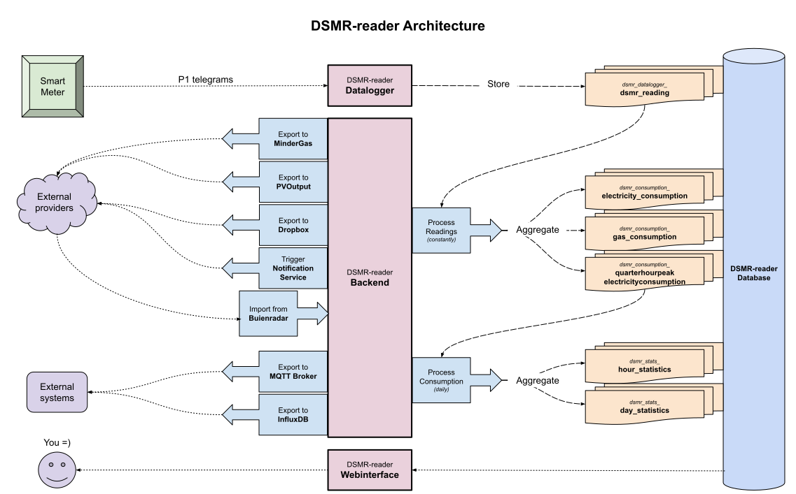

Languages
---------

The entire application and its code is written and documented in English.
The interface is translated into Dutch and will be enabled automatically, depending on your browser's language preference.

Hardware requirements
---------------------

- **For datalogger only**: *Any* RaspberryPi or similar.
- **For full DSMR-reader**: *RaspberryPi 4+* or similar.
- P1 telegram cable (or a network socket when using ``ser2net``).
- A smart meter supporting DSMR versions: ``v2`` / ``v4`` / ``v5``.

Software requirements
---------------------

- **OS**: ``RaspberryPi OS`` or similar (or using Docker).
- **Disk space**: 1+ GB - Depending on your smart meter and whether how many readings you want to preserve.
- **Code**: A `supported <https://devguide.python.org/versions/#python-release-cycle>`__ Python version.
- **Database**: A `supported <https://www.postgresql.org/support/versioning/>`__ PostgreSQL version.

Note that this project is built with `Django <https://www.djangoproject.com/>`__, which decides which Python/DB versions are actually supported.

Screenshots
-----------

Dashboard
^^^^^^^^^

The dashboard displays the latest information regarding the consumption of today.
You can view the total consumption for the current month and year as well.

If your meter supports it, you can also see your gas consumption and electricity returned.

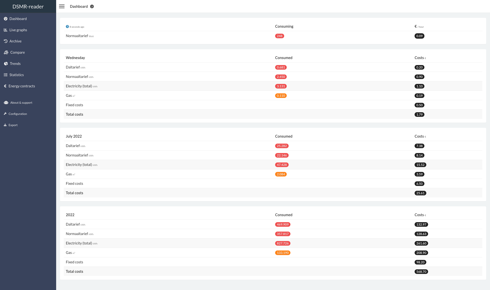

Live graphs
^^^^^^^^^^^

The live graphs plots the most recent data available, depending on the capabilities of your smart meter.

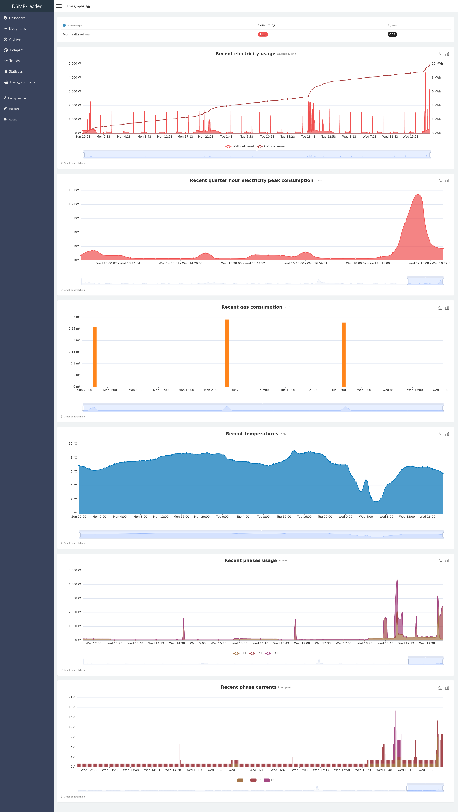

Archive
^^^^^^^

The archive allows you to scroll through all historisch data captured by the application.
All data can be viewed on different levels: by day, by month and by year.

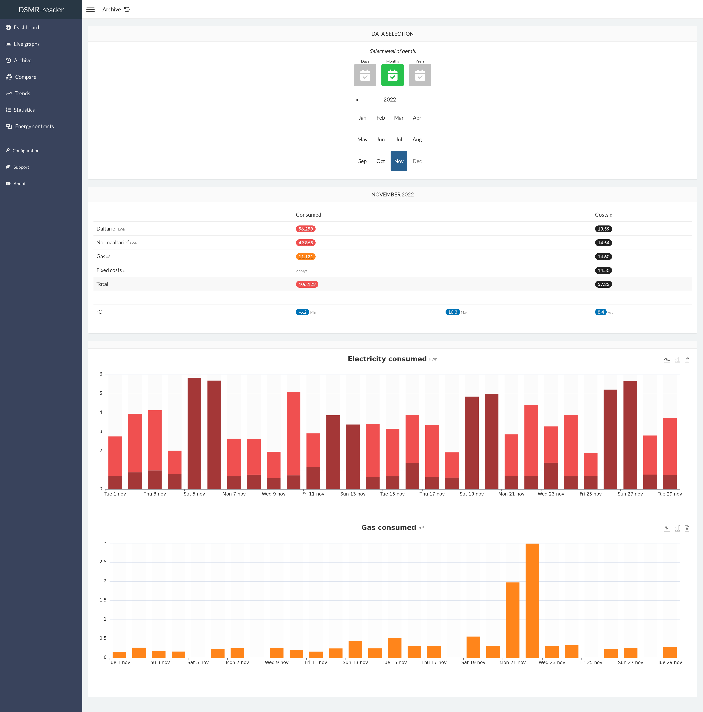

Compare
^^^^^^^

This page allows you to simply compare two days, months or years with each other.
It will also display the difference between each other as a percentage.

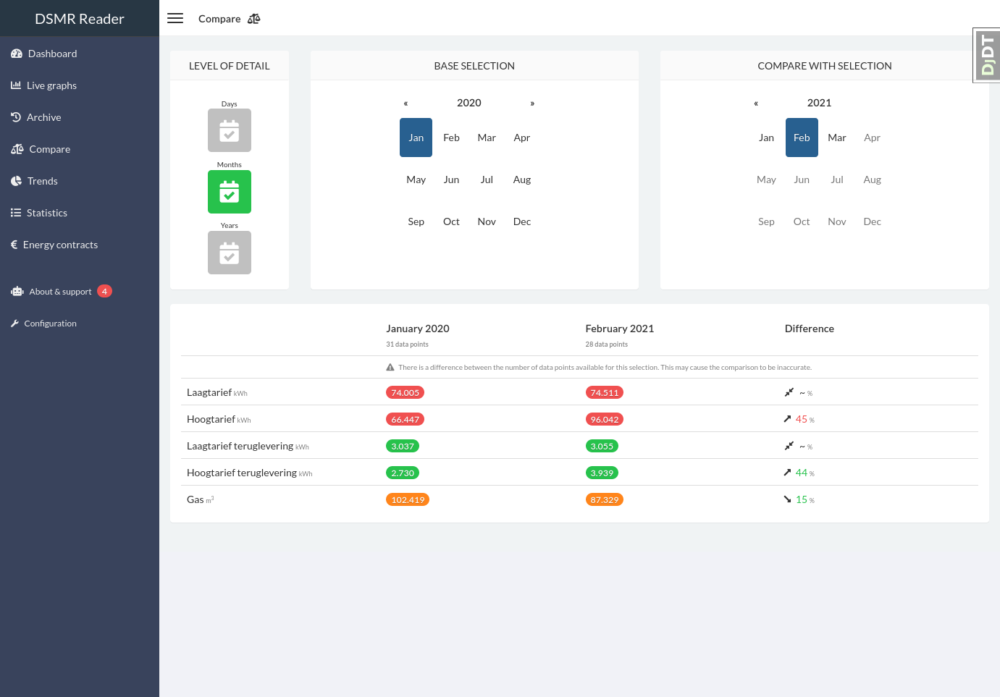

Trends
^^^^^^

This page displays a summary of your average daily consumption and habits.

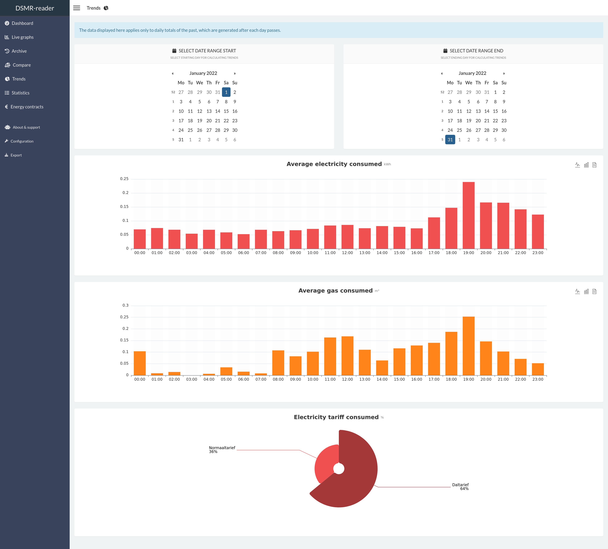

Statistics
^^^^^^^^^^

This page displays your meter positions and statistics provided by the DSMR protocol.
You can also find the number of readings stored and any excesses regarding consumption.

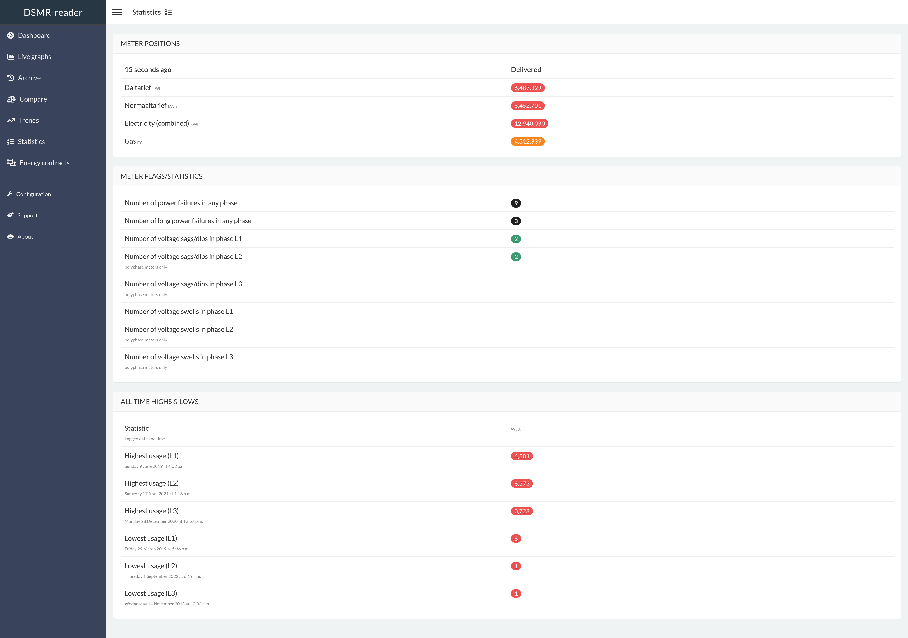

Energy contracts
^^^^^^^^^^^^^^^^

Summary of all your contracts and the amount of energy consumed/generated.

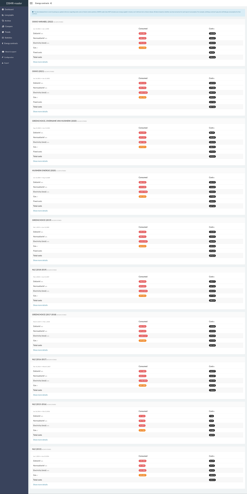

Export
^^^^^^

This pages allows you to export all day or hour statistics to CSV.

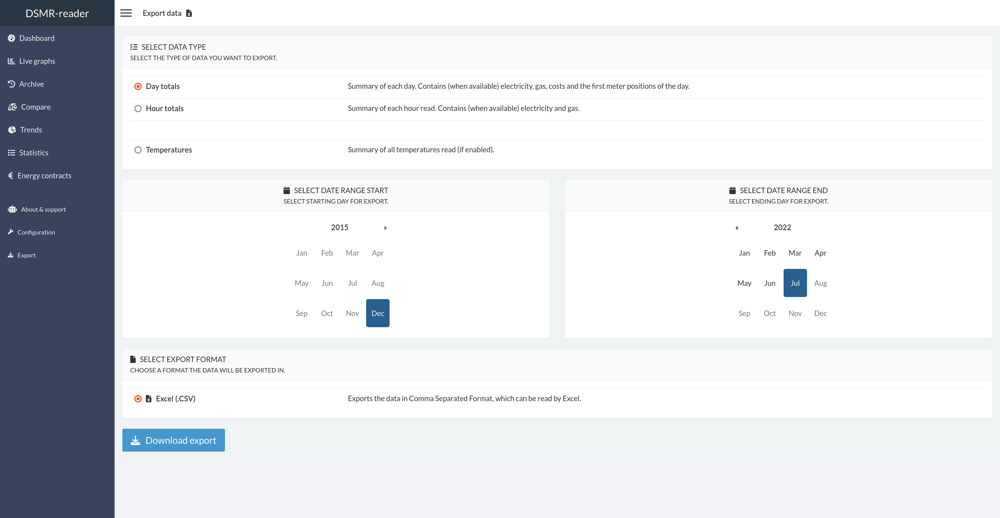

About
^^^^^

Shows the 'health' of the application. Any issues will be reported here.

You can also easily check for DSMR-reader updates here.

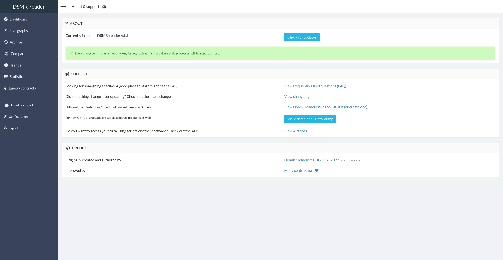

Support
^^^^^^^

Assists you in finding the information required for debugging your installation or any issues.

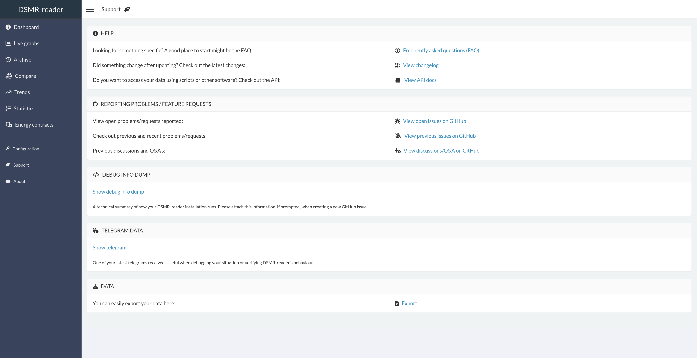

Configuration
^^^^^^^^^^^^^

The configuration page is the entrypoint for the admin interface.

You can type any topic or setting you're searching for, as it should pop up with clickable deeplink to the admin panel.
Or you can just skip it this page and continue directly to the admin panel.

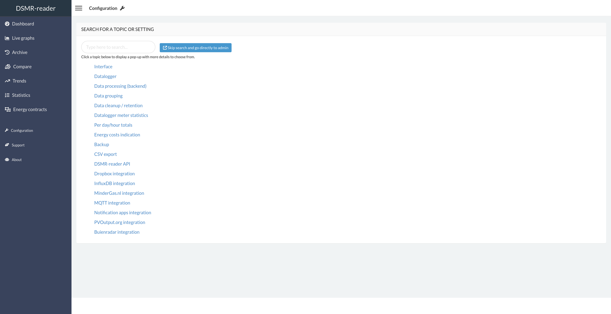
