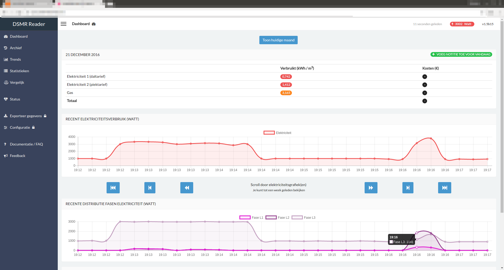

Frequently Asked Questions (FAQ)
================================

.. contents::
    :depth: 2

How can I update my application?
--------------------------------
The version you are running is always based on the 'latest' version of the application, called the `master` branch.
Every once in a while there may be updates. Since ``v1.5`` you can also easily check for updates by using the application's Status page.

.. warning::
    
    Before updating, **please make sure you have a recent backup of your database**! :doc:`More information about backups can be found here<application>`.

You can update your application to the latest version by executing **deploy.sh**, located in the root of the project. 
Make sure to execute it while logged in as the ``dsmr`` user::

   sudo su - dsmr
   ./deploy.sh

It will make sure to check, fetch and apply any changes released. Summary of deployment script steps:

- GIT pull (codebase update).
- PIP update requirements.
- Apply any database migrations.
- Sync static files to Nginx folder.
- Reload Gunicorn application server (web interface) and backend processes (such as the datalogger).
- Clear any caches.

Dropbox: Automated backup sync
------------------------------

:doc:`More information can be found here<dropbox>`.

Mindergas.nl: Automated gas meter position export
-------------------------------------------------

:doc:`More information can be found here<mindergas>`.

PVOutput.org: Automated electricity consumption export
------------------------------------------------------

:doc:`More information can be found here<pvoutput>`.

Usage notification: Daily usage statistics on your smartphone
-------------------------------------------------------------

:doc:`More information can be found here<notifications>`.

I only pay for a single electricity tariff but I see two!
---------------------------------------------------------
DSMR (and your energy supplier) always reads both high and low tariff from your meter. 
It's possible however that you are only paying for a single tariff. 
In that case your energy supplier will simply merge both high and low tariffs to make it look like you have a single one.

This application displays separate tariffs by default, but supports merging them to a single one as well.
Just make sure that you apply the **same price to both electricity 1 and 2** and enable the option ``Merge electricity tariffs`` in the frontend configuration.

I want to see the load of each electricity phase as well
---------------------------------------------------------
Since ``DSMR-reader v1.5`` it's possible to track your ``P+`` (consumption) phases as well. You will need to enable this in the ``Datalogger configuration``.
There is a setting called ``Track electricity phases``. When active, this will log the current usage of those phases and plot these on the Dashboard page.

Please keep in mind:

- This will **not work retroactively**. The datalogger always discards all data not used.
- This feature will only work when your smart meter is connected to **three phases**. Even when having the setting enabled.
- When having tracking phases enabled, you should see a button in the Dashboard called ``Display electricity phases``. Click on it to show the graph.

You should see something similar to:

Recalculate prices retroactively
--------------------------------
*I've adjusted my energy prices but there are no changes! How can I regenerate them with my new prices?*

Statistics for each day are generated once, the day after. However, you can flush your statistics by executing:

``./manage.py dsmr_backend_delete_aggregated_data``

The application will delete all statistics and (slowly) regenerate them in the background. Just make sure the source data is still there.

I'm not seeing any gas readings
-------------------------------
Please make sure that your meter supports reading gas consumption and that you've waited for a few hours for any graphs to render. 
The gas meter positions are only be updated once per hour (for DSMR v4).
The Status page will give you insight in this as well.

How do I restore a database backup?
-----------------------------------

.. warning::

    Restoring a backup will replace any existing data stored in the database and is irreversible! 

.. note::

    Do you need a complete reinstall of DSMR-reader as well? 
    Then please :doc:`follow the install guide<installation>` and restore the database backup **using the notes at the end of chapter 1**. 

Only want to restore the database?

- This asumes you are still running the same application version as the backup was created in.

- Stop the application first with ``sudo supervisorctl stop all``. This will disconnect it from the database as well.

- Importing the data could take a long time. It took MySQL 15 minutes to import nearly 3 million readings, from a compressed backup, on a RaspberryPi 3. 

For **PostgreSQL** restores::

    sudo sudo -u postgres dropdb dsmrreader
    sudo sudo -u postgres createdb -O dsmrreader dsmrreader
    
    # Either restore an uncompressed (.sql) backup:
    sudo sudo -u postgres psql dsmrreader -f <PATH-TO-POSTGRESQL-BACKUP.sql>
    
    # OR
    
    # Restore a compressed (.gz) backup with:
    zcat <PATH-TO-POSTGRESQL-BACKUP.sql.gz> | sudo sudo -u postgres psql dsmrreader

For **MySQL** restores::

    sudo mysqladmin create dsmrreader
    sudo mysqladmin drop dsmrreader
    
    # Either restore an uncompressed (.sql) backup:
    cat <PATH-TO-MYSQL-BACKUP.sql.gz> | sudo mysql --defaults-file=/etc/mysql/debian.cnf -D dsmrreader
    
    # OR
    
    # Restore a compressed (.gz) backup with:
    zcat <PATH-TO-MYSQL-BACKUP.sql.gz> | sudo mysql --defaults-file=/etc/mysql/debian.cnf -D dsmrreader

- Start the application again with ``sudo supervisorctl start all``.

.. note::

    In case the version differs, you can try forcing a deployment reload by: ``sudo su - dsmr`` and then executing ``./post-deploy.sh``.

Feature/bug report
------------------
*How can I propose a feature or report a bug I've found?*

.. seealso::
    
    `Just create a ticket at Github <https://github.com/dennissiemensma/dsmr-reader/issues/new>`_.
