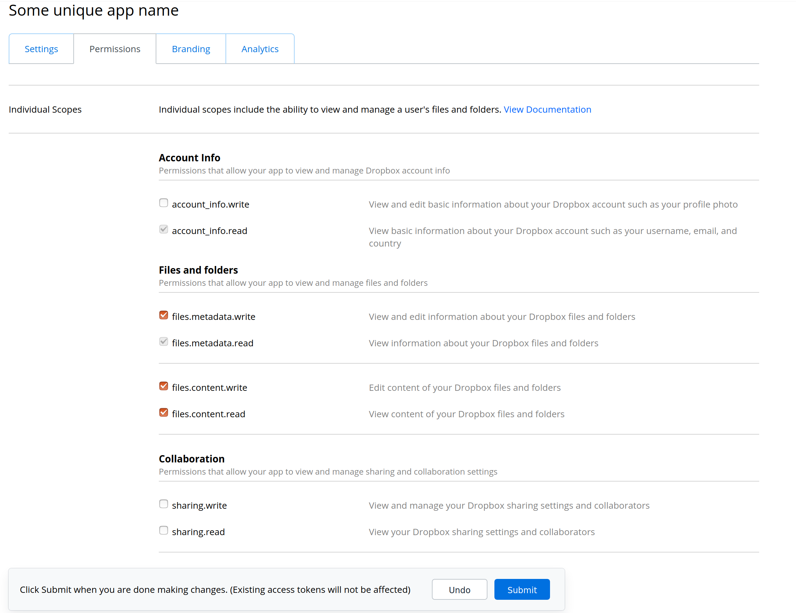

Admin: Backup & Dropbox
=======================

Backup
~~~~~~

The application backs up your data daily. You can change the time the backup will be created every day.

.. image:: ../../_static/screenshots/v4/admin/backupsettings.png
    :target: ../../_static/screenshots/v4/admin/backupsettings.png

Dropbox
~~~~~~~

You can use your Dropbox-account to make sure your backups are safely stored in your account.

.. image:: ../../_static/screenshots/v4/admin/dropboxsettings.png
    :target: ../../_static/screenshots/v4/admin/dropboxsettings.png

.. hint::

    Make sure you have a Dropbox-account or sign up for one.

----

Now go to `Dropbox Apps <https://www.dropbox.com/developers/apps>`_ and click ``Create app`` in top right corner:

.. image:: ../../_static/faq/dropbox_apps_overview.png
    :target: ../../_static/faq/dropbox_apps_overview.png

----

Choose (1) ``Scoped access``, (2) ``App folder`` and (3) enter a name for your app:

.. tip::

    It has to be unique among all Dropbox app names globally and it will also be used as the **directory name**, within the Apps-folder of your own Dropbox account.

.. image:: ../../_static/faq/dropbox_create_app.png
    :target: ../../_static/faq/dropbox_create_app.png

----

After creation, go to the **Permissions** tab and check the boxes for:

- ``files.metadata.write``
- ``files.metadata.read``
- ``files.content.write``
- ``files.content.read``

And don't forget to click **Submit** on the bottom of the page.

----

On the **Settings** tab set ``Access token expiration`` to ``No expiration`` and click the ``Generate`` button below ``Generated access token``.

.. image:: ../../_static/faq/dropbox_app_token.png
    :target: ../../_static/faq/dropbox_app_token.png

Copy the **generated access token** to the DSMR-reader settings for the Dropbox-configuration.
The DSMR-reader application should shortly sync any backups created.

.. tip::

    Check the `backend logs <https://dsmr-reader.readthedocs.io/en/latest/how-to/troubleshooting/logfiles.html>`_ if the backup files do not appear in the dropbox folder.
