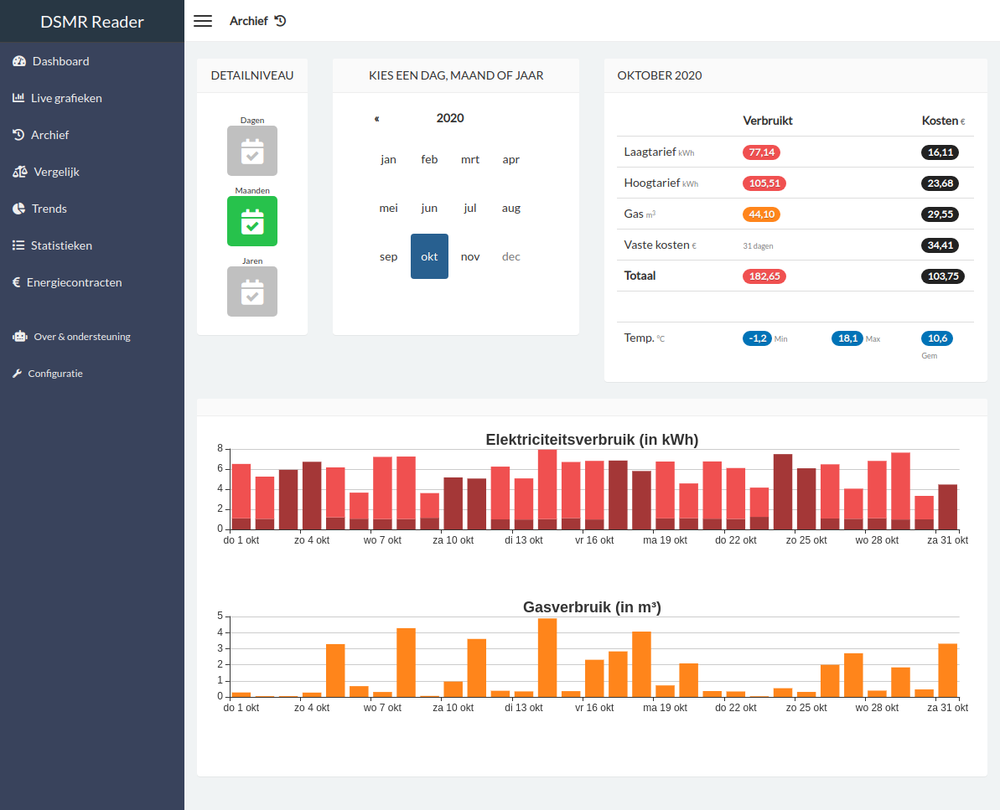
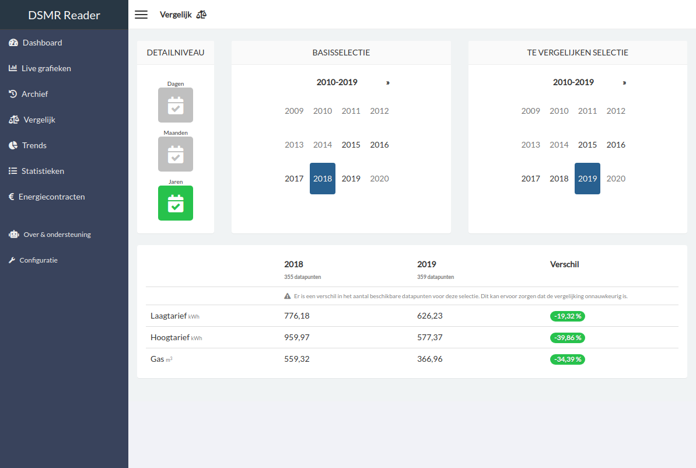
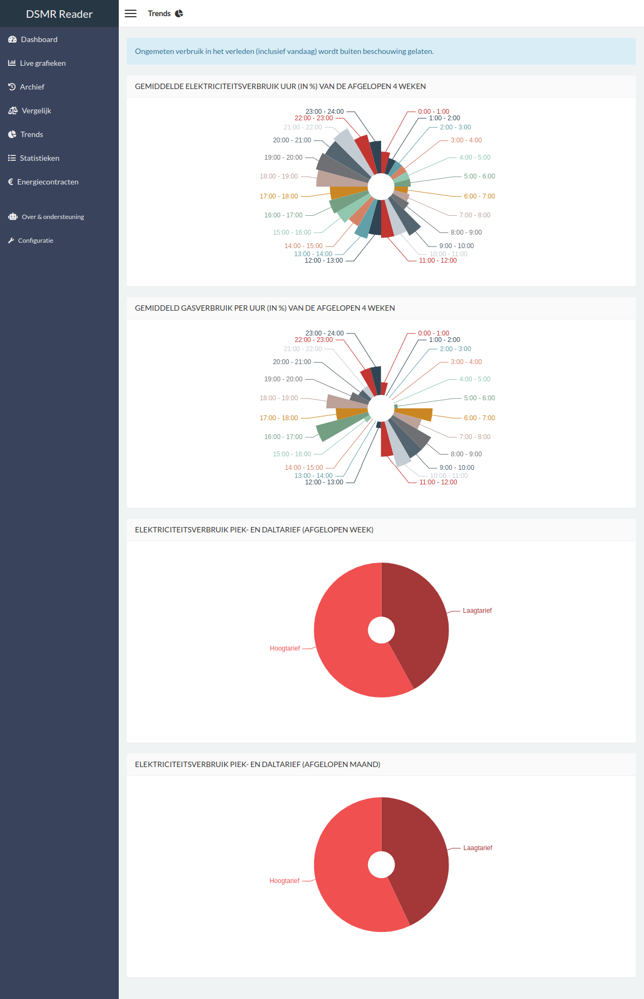

Introduction
============

.. contents::
    :depth: 3

Project goals
-------------
- Provide a tool to easily extract and store data transferred by the DSMR protocol of your smart meter.
- Allowing to export your data to other systems or third parties. It's your data, you decide.

Features
--------
DSMR-reader has the following features:

- Read telegram data from serial port
- Read telegram data from network socket
- Receive telegram data through its (REST) API
- Process, store and plot telegram data extensively
- Daily cost indication using your energy prices
- Push notifications through Pushover / Prowl
- Automated export to your MinderGas.nl account
- Automated export to your PVOutput.org account
- Automated export to an MQTT broker
- Automated export to an InfluxDB
- Automated backup to Dropbox
- Automated backup through email
- And many others...

Languages
---------

The entire application and its code is written and documented in English.
The interface is translated into Dutch and will be enabled automatically, depending on your browser's language preference.

Support for:

- English
- Dutch

Hardware requirements
---------------------

- For datalogger only: **Any** RaspberryPi or similar
- For full DSMR-reader: **RaspberryPi 3+** or similar
- P1 telegram cable (or a network socket when using ``ser2net``)

Software requirements
---------------------

- OS: ``Raspbian OS`` or similar
- Disk space: `1+ GB` (depends on whether you archive all readings)
- Python: `3.6` or higher
- Smart Meter DSMR versions: `v2` / `v4` / `v5`

.. warning::

    - Support for ``Python 3.3`` has been **discontinued** since ``DSMR-reader v1.5``
    - Support for ``Python 3.4`` has been **discontinued** since ``DSMR-reader v2.0``
    - Support for ``Python 3.5`` has been **discontinued** since ``DSMR-reader v3.0``

Screenshots / tour
------------------

Dashboard
^^^^^^^^^

The dashboard displays the latest information regarding the consumption of today.
You can view the total consumption for current month as well.
The graphs can be zoomed and display data up to the last 24 hours.

If your meter supports it, you can also see your gas consumption and electricity returned.

.. image:: _static/screenshots/v4.7/frontend/dashboard.png
    :target: _static/screenshots/v4.7/frontend/dashboard.png
    :alt: Dashboard

Live graphs
^^^^^^^^^^^

The live graphs plots the most recent data available, depending on the capabilities of your smart meter.

.. image:: _static/screenshots/v4.7/frontend/live.png
    :target: _static/screenshots/v4.7/frontend/live.png
    :alt: Live graphs

Archive
^^^^^^^

The archive allows you to scroll through all historisch data captured by the application.
All data can be viewed on different levels: by day, by month and by year.

Compare
^^^^^^^

This page allows you to simply compare two days, months or years with each other.
It will also display the difference between each other as a percentage.

Trends
^^^^^^

This page displays a summary of your average daily consumption and habits.

Statistics
^^^^^^^^^^

This page displays your meter positions and statistics provided by the DSMR protocol.
You can also find the number of readings stored and any excesses regarding consumption.

.. image:: _static/screenshots/v4.7/frontend/statistics.png
    :target: _static/screenshots/v4.7/frontend/statistics.png
    :alt: Statistics

Energy contracts
^^^^^^^^^^^^^^^^

Summary of all your contracts and the amount of energy consumed/generated.

.. image:: _static/screenshots/v4.7/frontend/energy-contracts.png
    :target: _static/screenshots/v4.7/frontend/energy-contracts.png
    :alt: Energy contracts

Export
^^^^^^

This pages allows you to export all day or hour statistics to CSV.

.. image:: _static/screenshots/v4.7/frontend/export.png
    :target: _static/screenshots/v4.7/frontend/export.png
    :alt: Export

About
^^^^^

Shows the 'health' of the application and provides a lot of background information.

You can also easily check for DSMR-reader updates here.

.. image:: _static/screenshots/v4.7/frontend/about.png
    :target: _static/screenshots/v4.7/frontend/about.png
    :alt: Status

Configuration
^^^^^^^^^^^^^

The configuration page is the entrypoint for the admin interface.

You can type any topic or setting you're searching for, as it should pop up with clickable deeplink to the admin panel.
Or you can just skip it this page and continue directly to the admin panel.

.. image:: _static/screenshots/v4.7/frontend/configuration.png
    :target: _static/screenshots/v4.7/frontend/configuration.png
    :alt: Configuration
