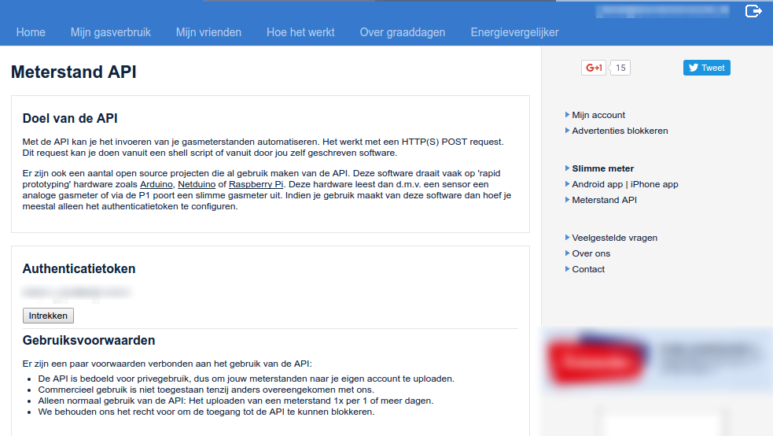

Integration: MinderGas.nl
=========================

.. contents::
    :depth: 2

Mindergas.nl: Automated gas meter position export
-------------------------------------------------
*How can I link my mindergas.nl account?*

Make sure you have a Mindergas.nl account or `signup for one <https://www.mindergas.nl/users/sign_up>`_. 
Now go to "`Meterstand API <https://www.mindergas.nl/member/api>`_" and click on the button located below **"Authenticatietoken"**.
  

Copy the authentication token generated and paste in into the DSMR-reader settings for the Mindergas.nl-configuration.
Obviously the export only works when there are any gas readings at all and you have ticked the 'export' checkbox in the Mindergas.nl-configuration as well.

.. note::

    Please note that due to policies of mindergas.nl it's not allowed to retroactively upload meter positions using the API. 
    Therefor this is not supported by the application. You can however, enter them manually on their website. 
