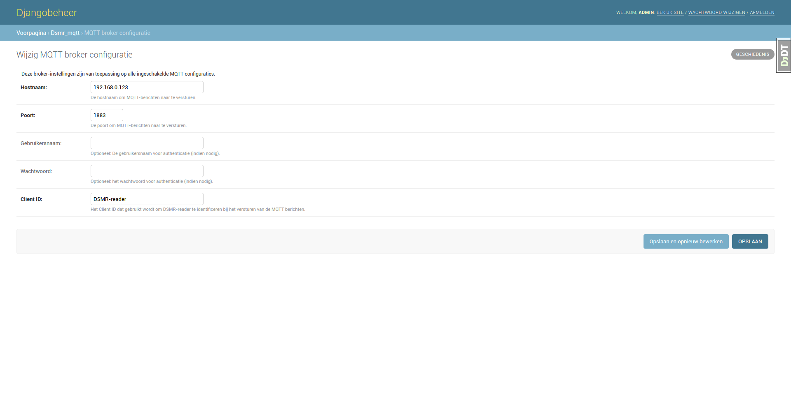
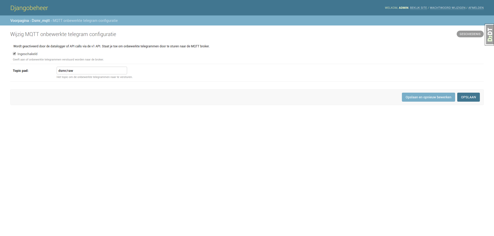
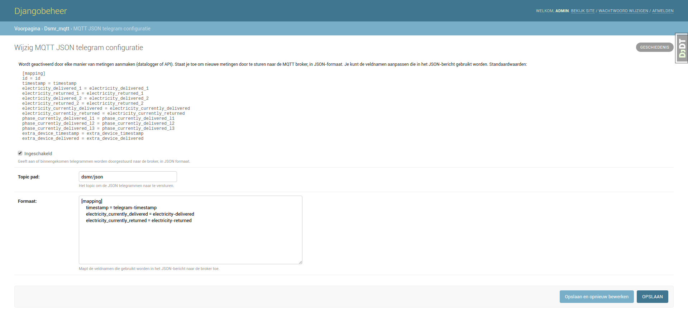
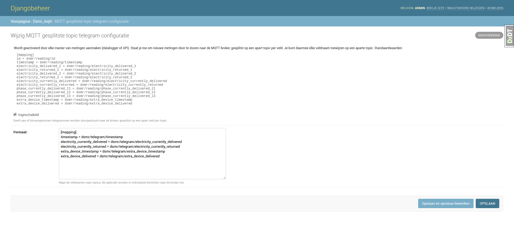

MQTT
====

The application supports sending MQTT messages to your broker.

.. contents::

Events
------
The following events can trigger MQTT messages when enabled:

Raw telegrams
^^^^^^^^^^^^^
Each time a telegram is read via the v1 API or datalogger. 
You can have the entire telegram string passed on to your MQTT broker.

Reading creation
^^^^^^^^^^^^^^^^
Each time a new reading is parsed, either created by the datalogger or v1/v2 API. 
You can have each parsed reading passed on to your broker either in JSON format or on a per-field per-topic basis.

Configuration
-------------
Support for MQTT is disabled by default in the application. 
You may enable it in your configuration or admin settings.

Broker configuration
^^^^^^^^^^^^^^^^^^^^
The broker configuration allows you to set the hostname and port of your broker. 
Optionally, you can enter any credentials here as well.

Raw telegram configuration
^^^^^^^^^^^^^^^^^^^^^^^^^^
This allows you to send each raw telegram received to your broker. 
Just enable it and enter the topic path it should be sent to.

JSON telegram configuration
^^^^^^^^^^^^^^^^^^^^^^^^^^^
This allows you to send each reading created to your broker, in JSON format. 
You can alter the field names used, by changing their name on the right hand side.
You may even remove the lines of the fields you wish to omit at all.

For example, this will format the JSON message to only contain these fields::

    [mapping]
    timestamp = telegram-timestamp
    electricity_currently_delivered = electricity-delivered
    electricity_currently_returned = electricity-returned
    
    # Result sent to topic:
    {
        "electricity-returned": "00.000",
        "electricity-delivered": "00.196",
        "telegram-timestamp": "2017-06-13T15:28:38Z"
    }

Split topic telegram configuration
^^^^^^^^^^^^^^^^^^^^^^^^^^^^^^^^^^
This allows you to send each reading created, but splitted in multiple messages.
For each field you can designate a separate topic, by changing their path on the right hand side.
You can remove the lines of the fields you wish to 

For example, this will make the application only broadcast these fields to their topics::

    [mapping]
    timestamp = dsmr/reading/timestamp
    electricity_currently_delivered = dsmr/reading/electricity-delivered
    electricity_currently_returned = dsmr/reading/electricity-returned
