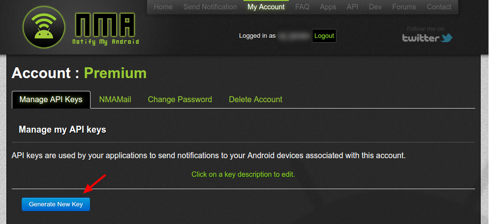
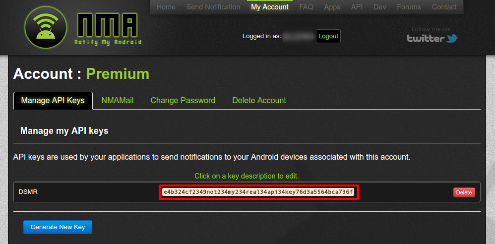
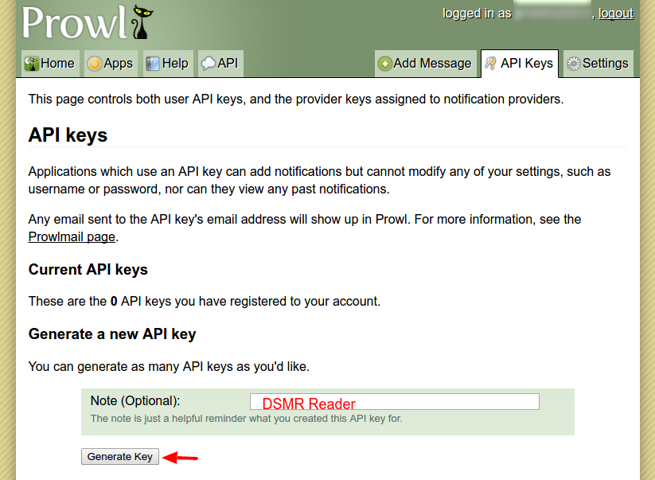
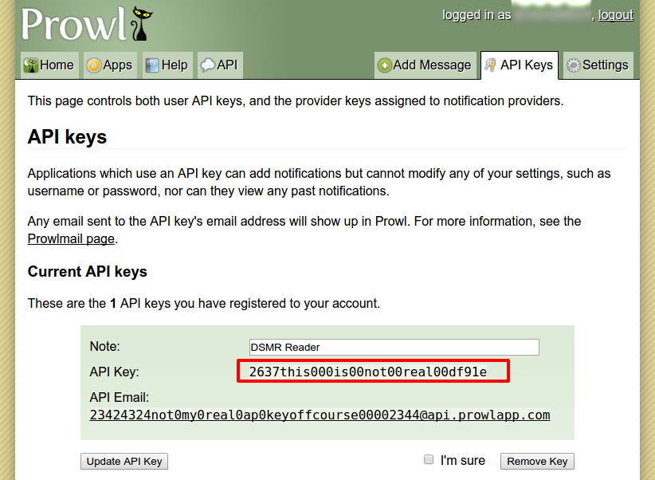

Integration: Notifications
==========================

.. contents::
    :depth: 2

Usage notification: Daily usage statistics on your smartphone
-------------------------------------------------------------
*Which services for sending notifications are supported?*

Currently, two mobile platforms are supported: Android and iOS.
The supported app for Android is `NotifyMyAndroid <https://www.notifymyandroid.com>`_. 
The supported app for iOS is `Prowl <https://www.prowlapp.com>`_. 

*How do I setup usage notifications?*

Make sure you either have NotifyMyAndroid or Prowl installed on your smartphone. If you don't, visit your platforms app store to download the app and sign up for an account. Then, make sure to get your API key from the notificationservice that you prefer. For instruction on obtaining the API key, please read below.

In the DSMR-reader settings for the Usagenotifications, tick the Send Notifications checkbox and select the notification service you want to use. Then copy the API key from the notification service and paste in into the the textbox for the API key. When you save these settings, your first notification should be sent after midnight. Don't worry, the notification will be sent with low priority and will not wake you up.

*How do I obtain my API key for NotifyMyAndroid?*

After you have downloaded NotifyMyAndroid and signed up for an account you should be able to `login to your NotifyMyAndroid account <https://www.notifymyandroid.com/index.jsp>`_. 
Now go to "`My Account <https://www.notifymyandroid.com/account.jsp>`_", you should see an overview of your current API keys if you have any. To create an API key for the DSMR-reader, please click **"Generate New Key"**.

    
When a new key is generated, you will see it immediatly. Your key is listed like in the screenshot below (the red box marks your API key).

*How do I obtain my API key for Prowl?*

After you have downloaded Prowl and signed up for an account you should be able to `login to your Prowl account <https://www.prowlapp.com/login.php>`_. 
Now go to "`API Keys <https://www.prowlapp.com/api_settings.php>`_", you should see an overview of your current API keys if you have any. To create an API key for the DSMR-reader, input a name and click **"Generate Key"**.

    
When a new key is generated, you will see it immediatly. Your key is listed like in the screenshot below (the red box marks your API key).

