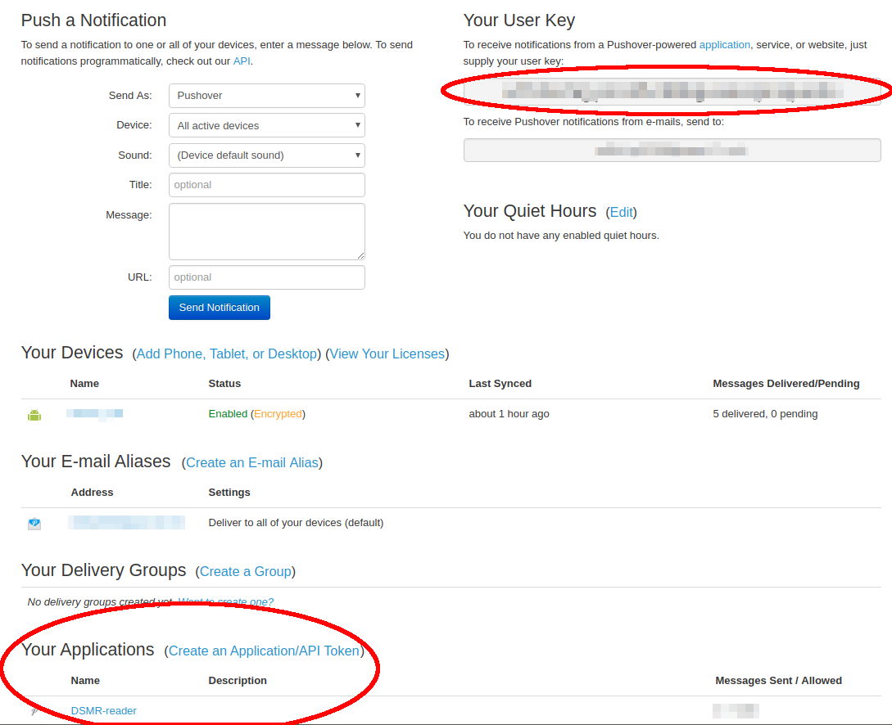

Integration: Notifications
==========================

.. contents::
    :depth: 2

Usage notification: Daily usage statistics on your smartphone
-------------------------------------------------------------

Which services for sending notifications are supported?
~~~~~~~~~~~~~~~~~~~~~~~~~~~~~~~~~~~~~~~~~~~~~~~~~~~~~~~

Currently, two mobile platforms are supported: Android and iOS.

* The supported app for Android is `Pushover <https://pushover.net>`_. 
* The supported apps for iOS are `Pushover <https://pushover.net>`_ and `Prowl <https://www.prowlapp.com>`_. 

How do I setup usage notifications?
~~~~~~~~~~~~~~~~~~~~~~~~~~~~~~~~~~~

Make sure you either have Pushover or Prowl installed on your smartphone. 
If you don't, visit your platforms app store to download the app and sign up for an account. 
Then, make sure to get your API key from the notification service that you prefer. 
For instruction on obtaining the API key, please read below.

In the DSMR-reader **Notifications Apps** settings, select the notification service you want to use. 
Copy the API key from the notification service and paste in into the the textbox for the API key. 
When you save these settings, your first notification should be sent after midnight. 
Don't worry about nightly alerts, the notifications will be sent with low priority and should not wake you up.

How do I obtain my API key for Pushover?
~~~~~~~~~~~~~~~~~~~~~~~~~~~~~~~~~~~~~~~~

After you have downloaded Pushover and signed up for an account you should be able to `login into your Pushover account <https://pushover.net>`_. 

You should see an overview of containing **Your User Key** (top right) and Applications, if you have any. 
To create an application in Pushover, for sending notifications to your phone, please click **Create an Application/API Token**.

Pushover requires you to enter two keys in DSMR-reader. 

* You will need the **User Key** displayed on the top right in the screenshot below. 
* And you will need the **API key** for the application you've created in Pushover.

How do I obtain my API key for Prowl?
~~~~~~~~~~~~~~~~~~~~~~~~~~~~~~~~~~~~~

After you have downloaded Prowl and signed up for an account you should be able to `login into your Prowl account <https://www.prowlapp.com/login.php>`_. 

Now go to "`API Keys <https://www.prowlapp.com/api_settings.php>`_", you should see an overview of your current API keys if you have any. 
To create an API key for the DSMR-reader, input a name and click **"Generate Key"**.

.. image:: _static/faq/notifications-prowl-create-key.png
    :target: _static/faq/notifications-prowl-key.png
    :alt: Prowl My Account overview
    
When a new key is generated, you will see it immediatly. Your key is listed like in the screenshot below (the red box marks your API key).

.. image:: _static/faq/notifications-prowl-get-key.png
    :target: _static/faq/notifications-prowl-get-key.png
    :alt: Prowl Get Your API Key
