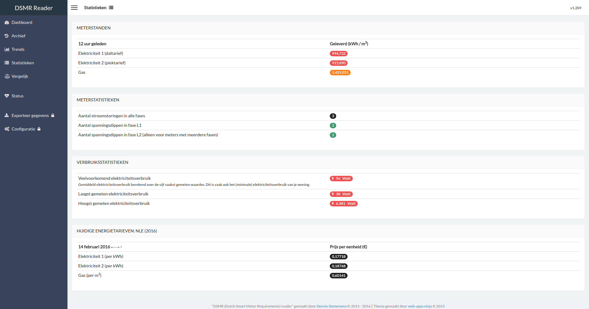
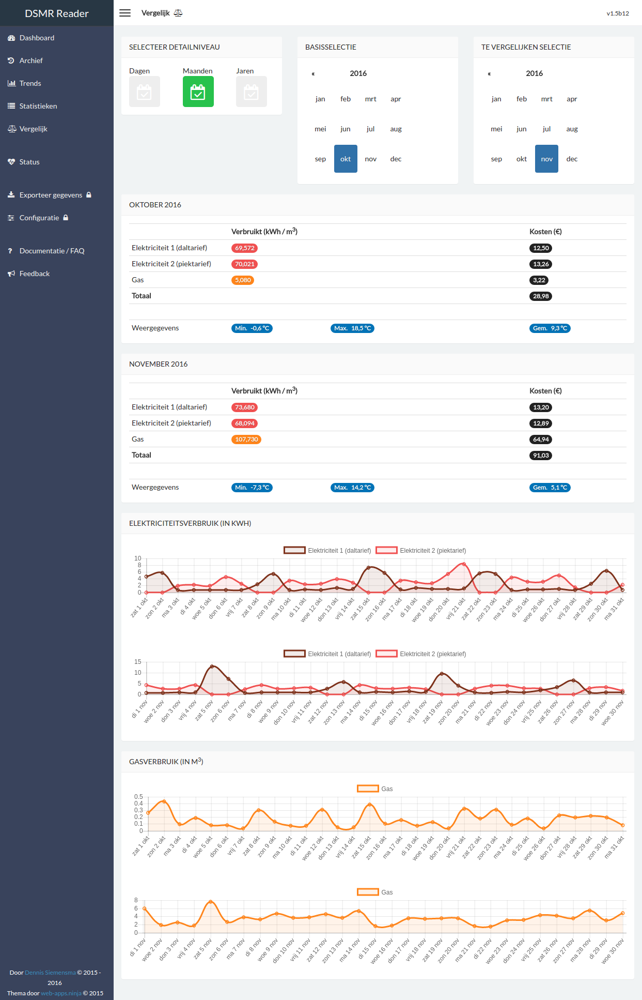
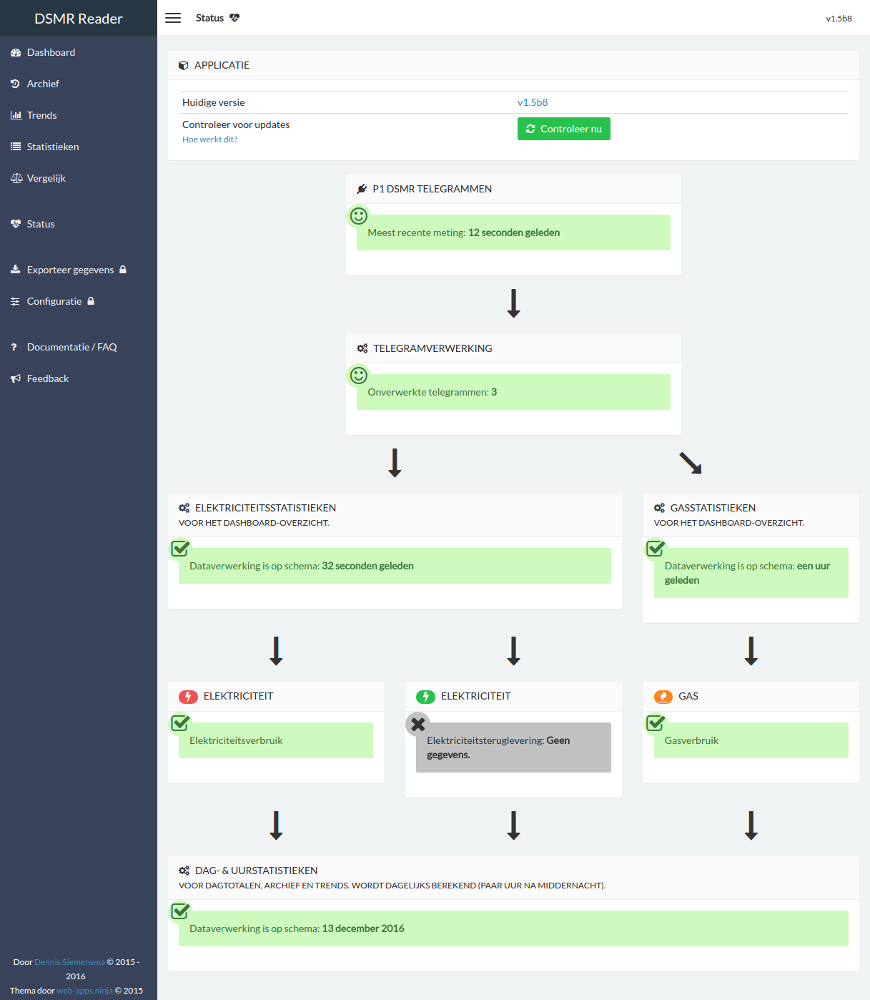
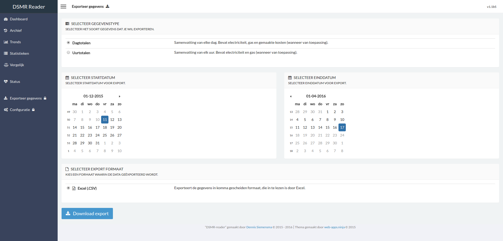
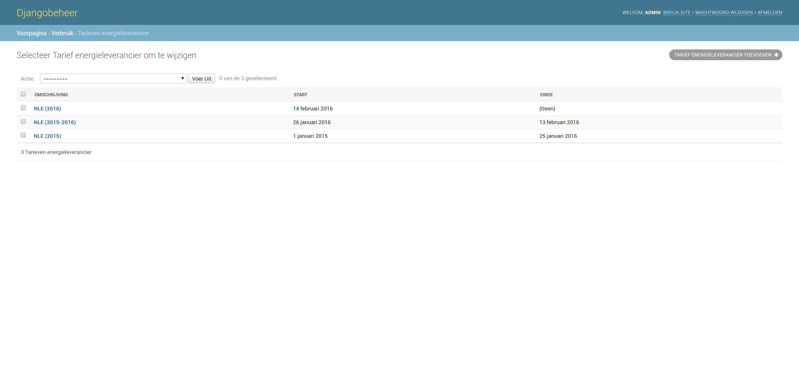
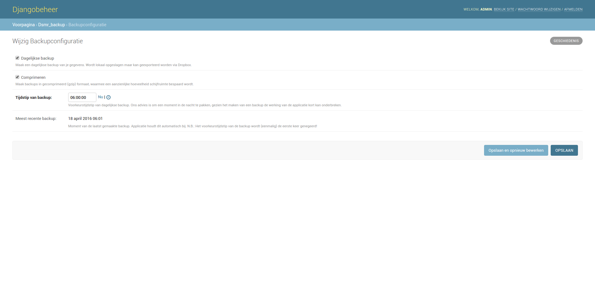

Screenshots
===========
Below you can find some screenshots of the application. Please read the note below regarding solar panels and support for them.

Solar panels & electricity returned
-----------------------------------
Note that **I do not have solar panels at home**, but the application however **does support plotting any electricity returned**.

Therefor there aren't any graphs of them in the screenshots, but the users who do have them, will have additional green graphs rendered in the application.  

Dashboard
---------
The dashboard displays the latest information regarding any consumption of today and the current month so far.

.. image:: _static/screenshots/dashboard.png
    :target: _static/screenshots/dashboard.png
    :alt: Dashboard
    
    
Archive
-------
The archive allows you to go back to any moment tracked. The data can be plotted either on day, month or year level.

.. image:: _static/screenshots/archive.png
    :target: _static/screenshots/archive.png
    :alt: Archive

Trends
------
Trends are an average summary of your daily consumption and habits.

.. image:: _static/screenshots/trends.png
    :target: _static/screenshots/trends.png
    :alt: Trends

Statistics
----------
The statistics page will display the current state of your meter and the energy prices currently apply (if any).

Compare
-------
This page allows you to compare two days, months or years tracked before. 

Status
------
The status page will show the 'health' of the application and any data tracked. If there are any problems regarding data handling, they should be indicated here.

Export
------
Want to export day totals or hourly data to Excel? This page allows you to export the data in .CSV format.

Configuration
-------------
The application has quite some features, such are temperature tracking, automated backups and Dropbox intergration. This page displays the status of them all.

.. image:: _static/screenshots/configuration.png
    :target: _static/screenshots/configuration.png
    :alt: Configuration

Settings
--------
The project is written using Django and some of it's backend pages are displayed below.

Here you may manage your energy prices:

This allows you to alter your backup settings:

There are several additional backend pages for the other configuration options as well. 