Screenshots
===========

Below you can find screenshots of the application.

.. contents::
    :depth: 2

Dashboard
---------

The dashboard displays the latest information regarding any consumption of today and the current month so far.

.. image:: _static/screenshots/frontend/dashboard.png
    :target: _static/screenshots/frontend/dashboard.png
    :alt: Dashboard
    
    
Archive
-------

The archive allows you to go back to any moment tracked. The data can be plotted either on day, month or year level.

.. image:: _static/screenshots/frontend/archive.png
    :target: _static/screenshots/frontend/archive.png
    :alt: Archive

Compare
-------
This page allows you to compare two days, months or years tracked before. 

.. image:: _static/screenshots/frontend/compare.png
    :target: _static/screenshots/frontend/compare.png
    :alt: Compare

Trends
------

Trends are an average summary of your daily consumption and habits.

.. image:: _static/screenshots/frontend/trends.png
    :target: _static/screenshots/frontend/trends.png
    :alt: Trends

Statistics
----------

The statistics page will display the current state of your meter and the energy prices currently apply (if any).

.. image:: _static/screenshots/frontend/statistics.png
    :target: _static/screenshots/frontend/statistics.png
    :alt: Statistics

Energy contracts
----------------

Summary of all your contracts and the amount of energy consumed/generated. 

.. image:: _static/screenshots/frontend/energy-contracts.png
    :target: _static/screenshots/frontend/energy-contracts.png
    :alt: Energy contracts

Status
------

The status page shows the 'health' of the application and any data tracked.
If there are any problems regarding data handling, they should be highlighted here.

.. image:: _static/screenshots/frontend/status.png
    :target: _static/screenshots/frontend/status.png
    :alt: Status

Export
------
Want to export day totals or hourly data to Excel? This page allows you to export the data in .CSV format.

.. image:: _static/screenshots/frontend/export.png
    :target: _static/screenshots/frontend/export.png
    :alt: Export

Settings: Overview
------------------
The application has quite some features and most of them can be configured.

.. image:: _static/screenshots/admin/overview.png
    :target: _static/screenshots/admin/overview.png
    :alt: Configuration

Settings: API
-------------
Configure the API if you need it to supply telegrams or simply read data from DSMR-reader.

.. image:: _static/screenshots/admin/apisettings.png
    :target: _static/screenshots/admin/apisettings.png
    :alt: API

Settings: Backup & Dropbox
--------------------------
By default the application backs up your data locally.

.. image:: _static/screenshots/admin/backupsettings.png
    :target: _static/screenshots/admin/backupsettings.png
    :alt: Backup

You can use your Dropbox-account to make sure your backups are safely stored in your account. 

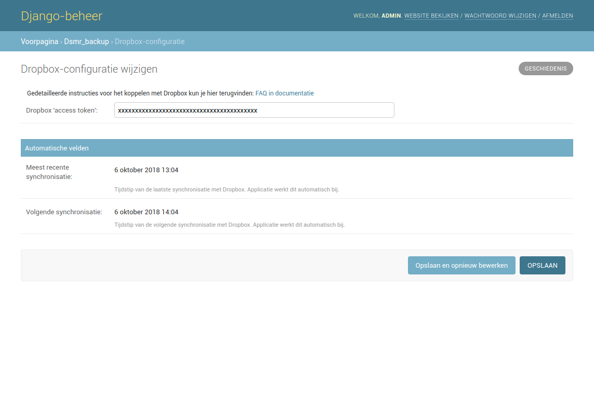

Settings: Datalogger & retention
--------------------------------
Configure the builtin datalogger.

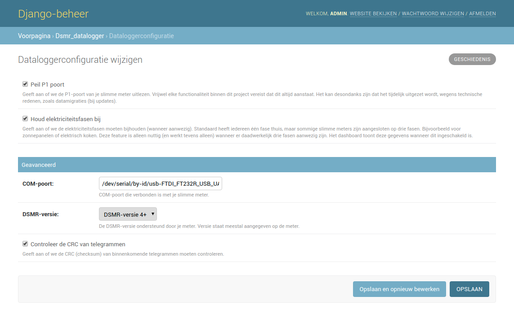

All source data read is stored indefinitely, but you can apply retention, only keeping the source data for a certain amount of time.
Day statistics will never be deleted.

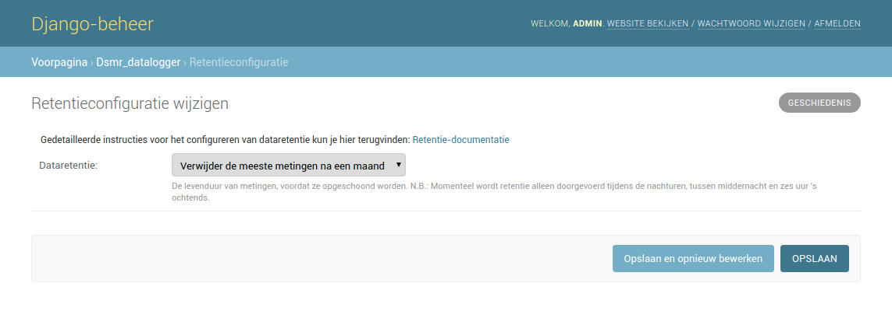

Settings: Interface
-------------------
You can change most colors used in graphs to your personal flavor. 

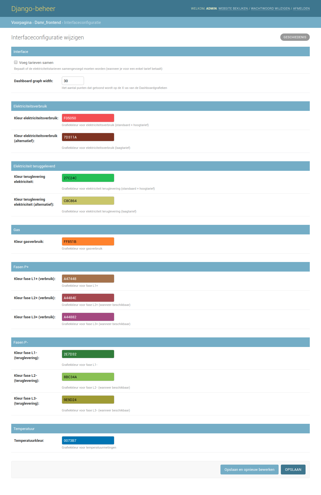

Settings: MinderGas.nl
----------------------
Link your MinderGas.nl-account to have DSMR-reader upload your gas meter position daily.

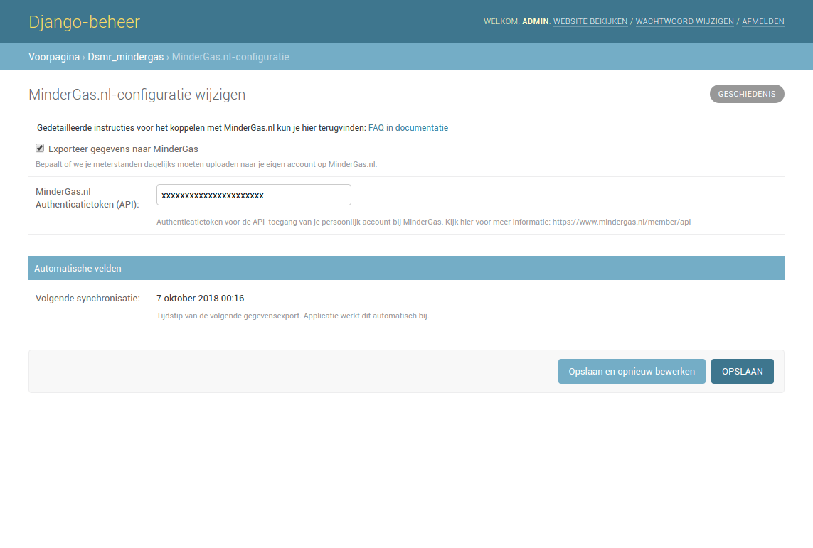

Settings: MQTT
--------------
There is support for MQTT messaging with a lot of options.

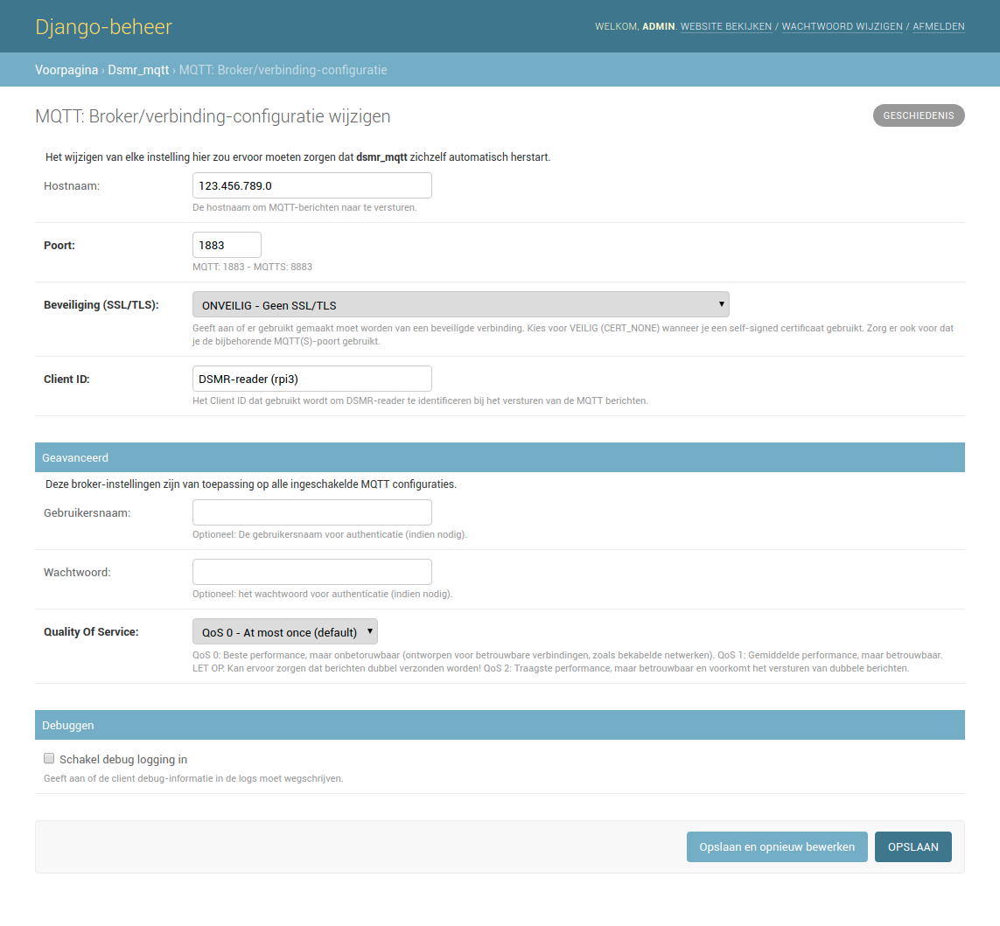

Get the day totals als JSON.

.. image:: _static/screenshots/admin/jsondaytotalsmqttsettings.png
    :target: _static/screenshots/admin/jsondaytotalsmqttsettings.png
    :alt: MQTT JSON day Totals

Or splitted per topic.

.. image:: _static/screenshots/admin/splittopicdaytotalsmqttsettings.png
    :target: _static/screenshots/admin/splittopicdaytotalsmqttsettings.png
    :alt: MQTT Split Topic Day Totals

Statistics of your meter.

.. image:: _static/screenshots/admin/splittopicmeterstatisticsmqttsettings.png
    :target: _static/screenshots/admin/splittopicmeterstatisticsmqttsettings.png
    :alt: MQTT Split Topic Meter Statistics

Telegram as JSON.

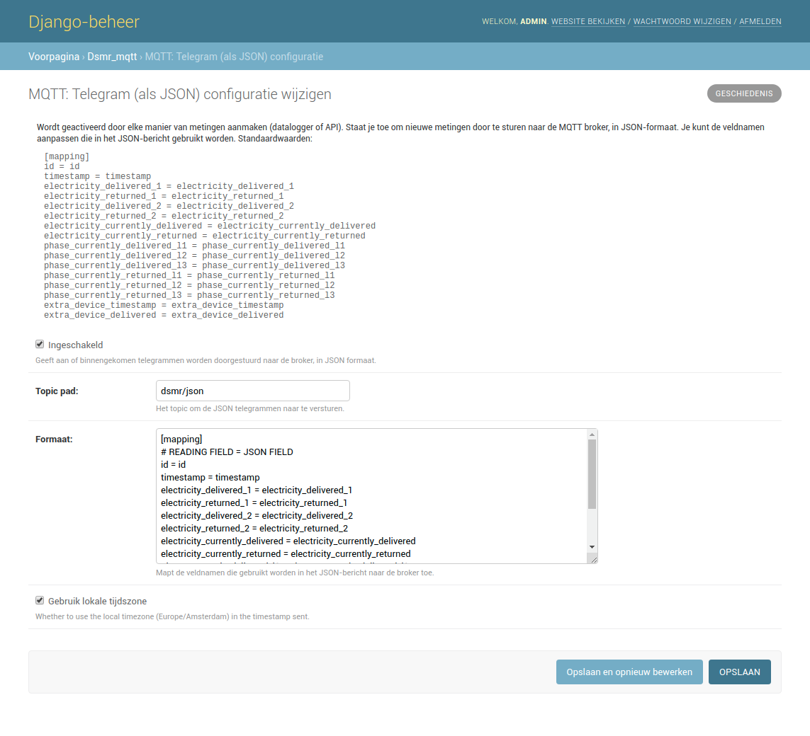

Or in raw format.

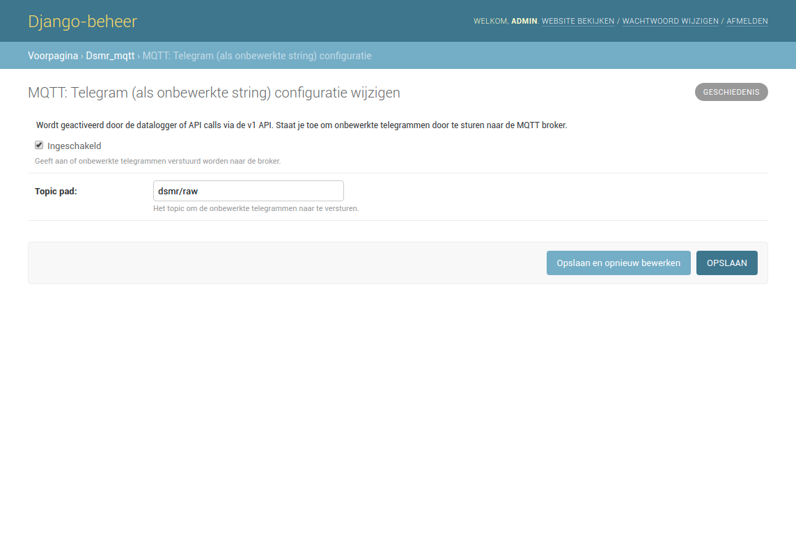

Or splitted per topic.

.. image:: _static/screenshots/admin/splittopictelegrammqttsettings.png
    :target: _static/screenshots/admin/splittopictelegrammqttsettings.png
    :alt: MQTT Split Topic Telegram

Settings: Notifications
-----------------------

Notifications on your phone using Prowl or Pushover. 

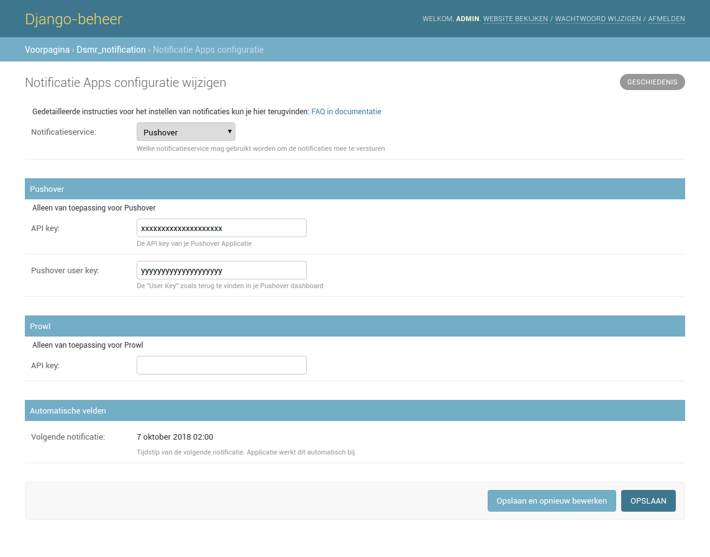

Settings: PVOutput
------------------

Link your PVOutput account to upload your electricity returned.

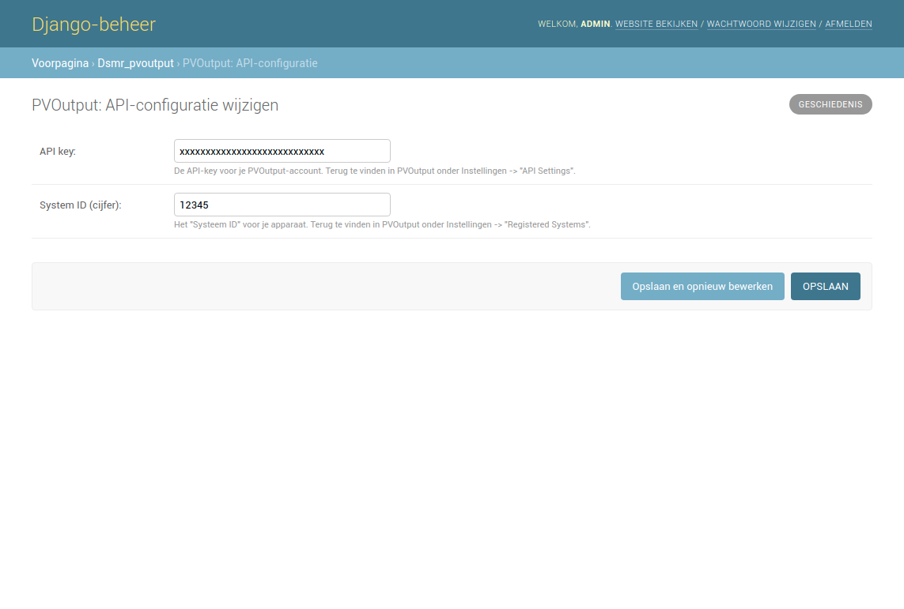

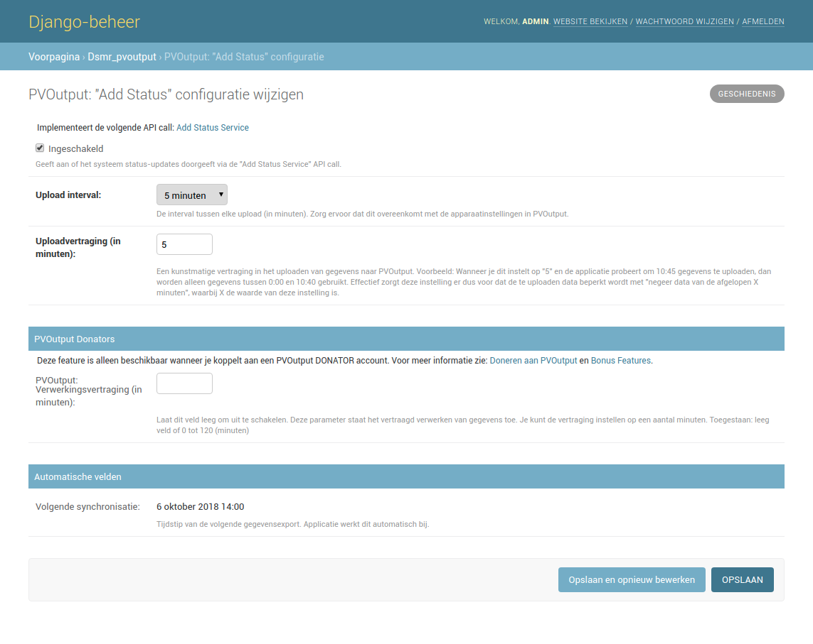

Settings: Consumption
---------------------

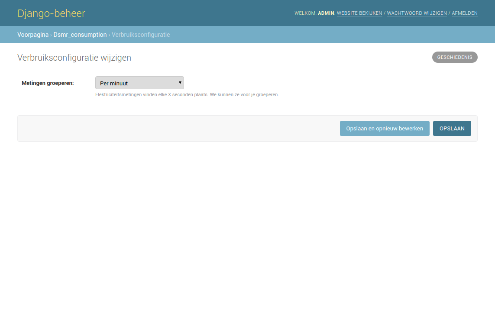

Settings: Temperatures
----------------------

Keep track of the temperatures outside using the Buienradar API.

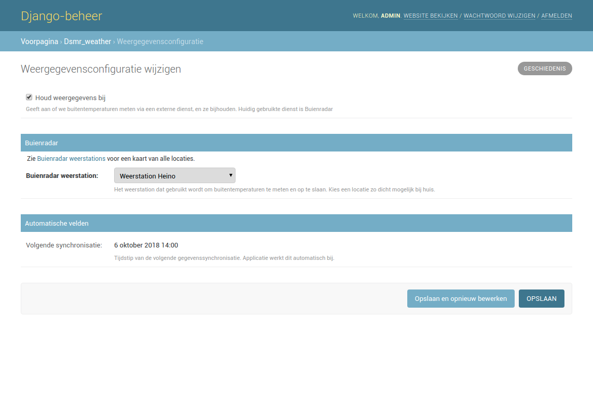

