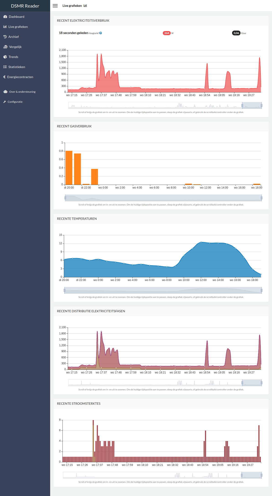
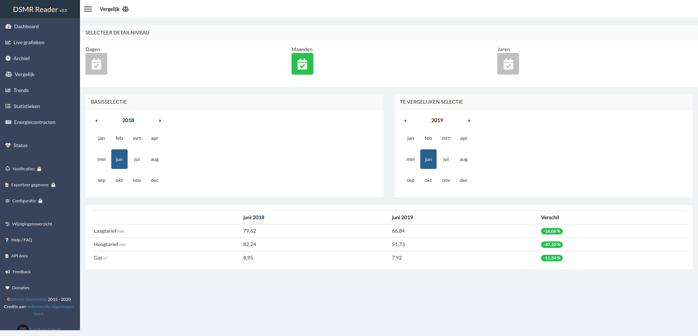
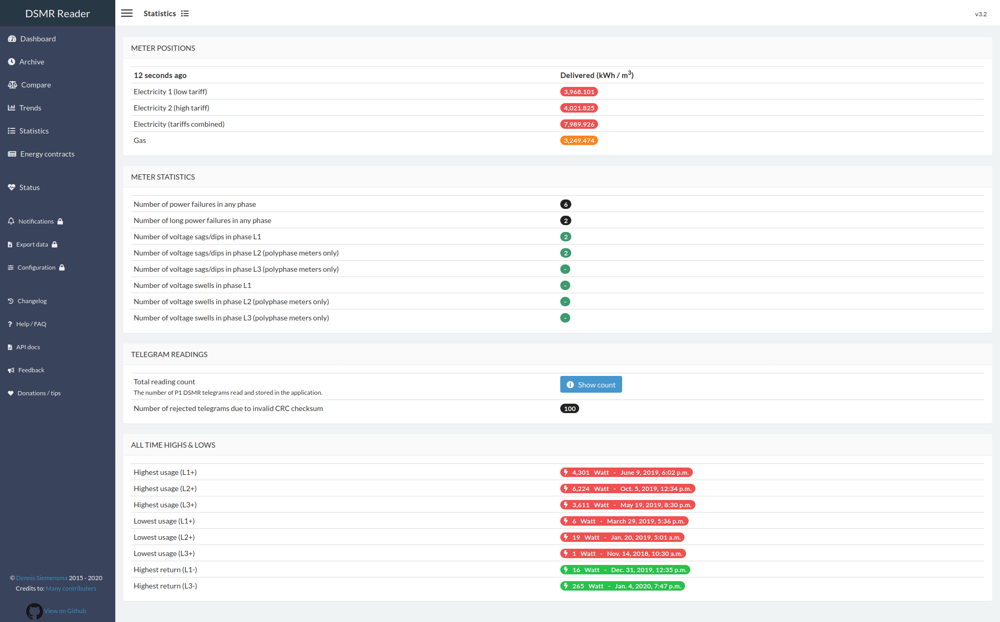
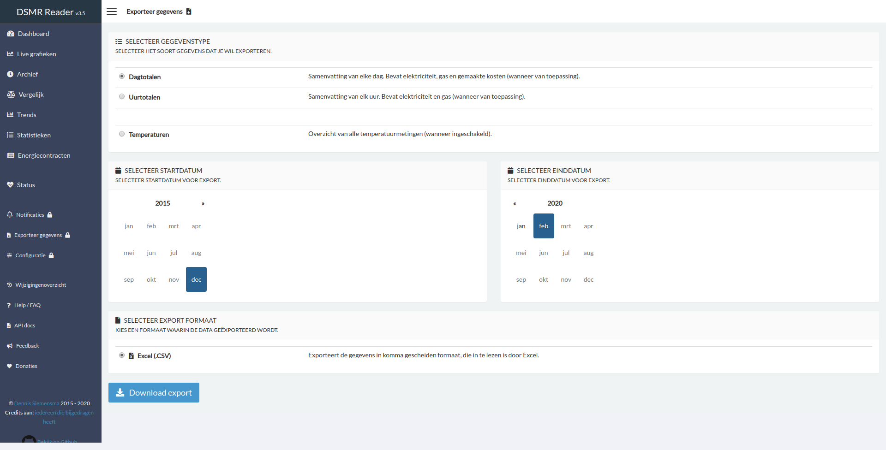
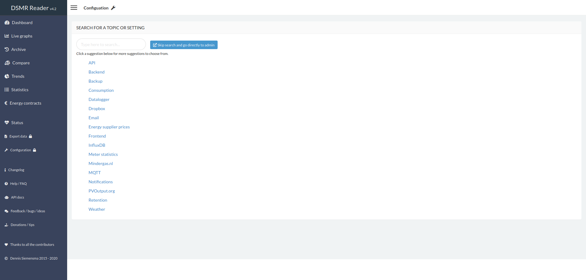

Dashboard
---------

The dashboard displays the latest information regarding the consumption of today.
You can view the total consumption for current month as well.
The graphs can be zoomed and display data up to the last 24 hours.

If your meter supports it, you can also see your gas consumption and electricity returned.

.. image:: _static/screenshots/frontend/dashboard.png
    :target: _static/screenshots/frontend/dashboard.png
    :alt: Dashboard

Live graphs
-----------

The live graphs plots the most recent data available, depending on the capabilities of your smart meter.

Archive
-------

The archive allows you to scroll through all historisch data captured by the application.
All data can be viewed on different levels: by day, by month and by year.

.. image:: _static/screenshots/frontend/archive.png
    :target: _static/screenshots/frontend/archive.png
    :alt: Archive

Compare
-------

This page allows you to simply compare two days, months or years with each other.
It will also display the difference between each other as a percentage.

Trends
------

This page displays a summary of your average daily consumption and habits.

.. image:: _static/screenshots/frontend/trends.png
    :target: _static/screenshots/frontend/trends.png
    :alt: Trends

Statistics
----------

This page displays your meter positions and statistics provided by the DSMR protocol.
You can also find the number of readings stored and any excesses regarding consumption.

Energy contracts
----------------

Summary of all your contracts and the amount of energy consumed/generated.

.. image:: _static/screenshots/frontend/energy-contracts.png
    :target: _static/screenshots/frontend/energy-contracts.png
    :alt: Energy contracts

Status
------

The status page shows the 'health' of the application and any data tracked.
If there are any problems regarding data handling, they should be highlighted here.

You can also easily check for DSMR-reader updates here.

.. image:: _static/screenshots/frontend/status.png
    :target: _static/screenshots/frontend/status.png
    :alt: Status

Export
------

This pages allows you to export all day or hour statistics to CSV.

Configuration
-------------

The configuration page is the entrypoint for the admin interface.

You can type any topic or setting you're searching for, as it should pop up with clickable deeplink to the admin panel.
Or you can just skip it this page and continue directly to the admin panel.

