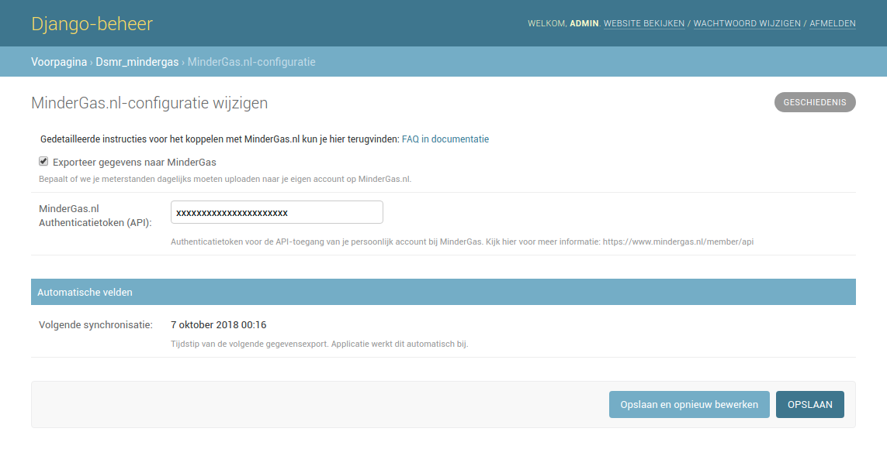
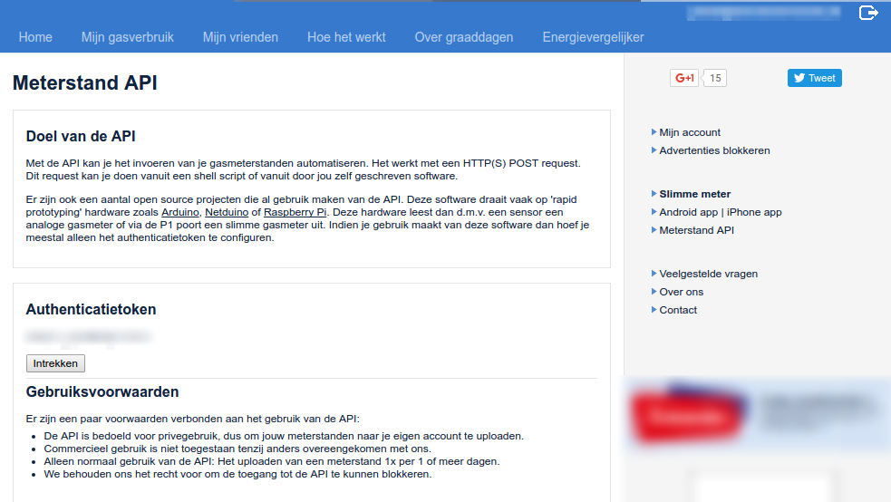

# MinderGas.nl

!!! note "For your information"

    This is a feature using or integrating a **third party** and may or may not break along the years.

    Usually this depends on the third party supporting it and the amount of (re)work needed in DSMR-reader to keep it backward/forward compatible.

Link your MinderGas.nl-account to have DSMR-reader upload your gas meter position daily.

!!! note

    DSMR-reader transmits the **last reading of the previous day** to your account.
    
    Also, to avoid overloading the MinderGas API by all DSMR-reader installations simultaneously, the export is **randomly** scheduled every night between 03:00 and 06:00.

Make sure you have a [Mindergas.nl](http://mindergas.nl) account or signup for one. 
Now go to "**Meterstand API**" and click on the button located below "**Authenticatietoken**".

Copy the authentication token generated and paste in into the DSMR-reader settings for the Mindergas.nl-configuration.
Obviously the export only works when there are any gas readings at all, and when you have ticked the 'export' checkbox in the Mindergas.nl-configuration.

!!! question "Why not uploading old data?"

    Please note that due to policies of mindergas.nl it's not allowed to retroactively upload meter positions using the API. 
    Therefor this is not supported by the application. You can however, enter them manually on their website. 
