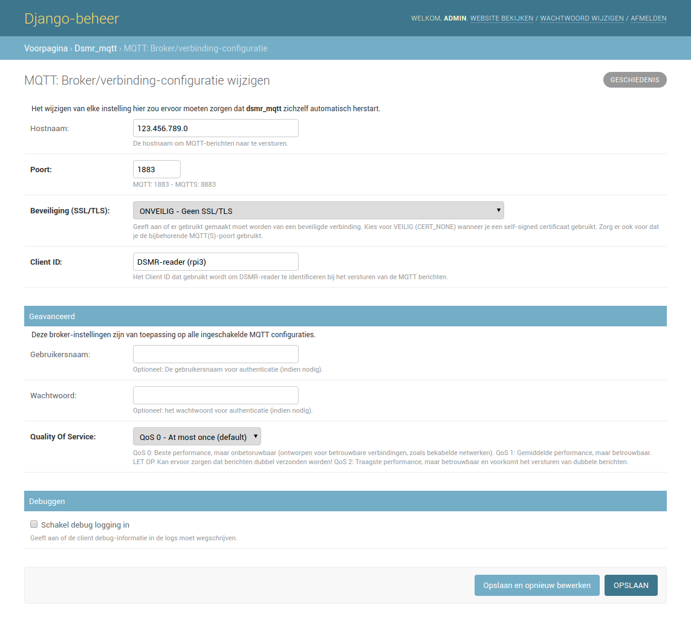
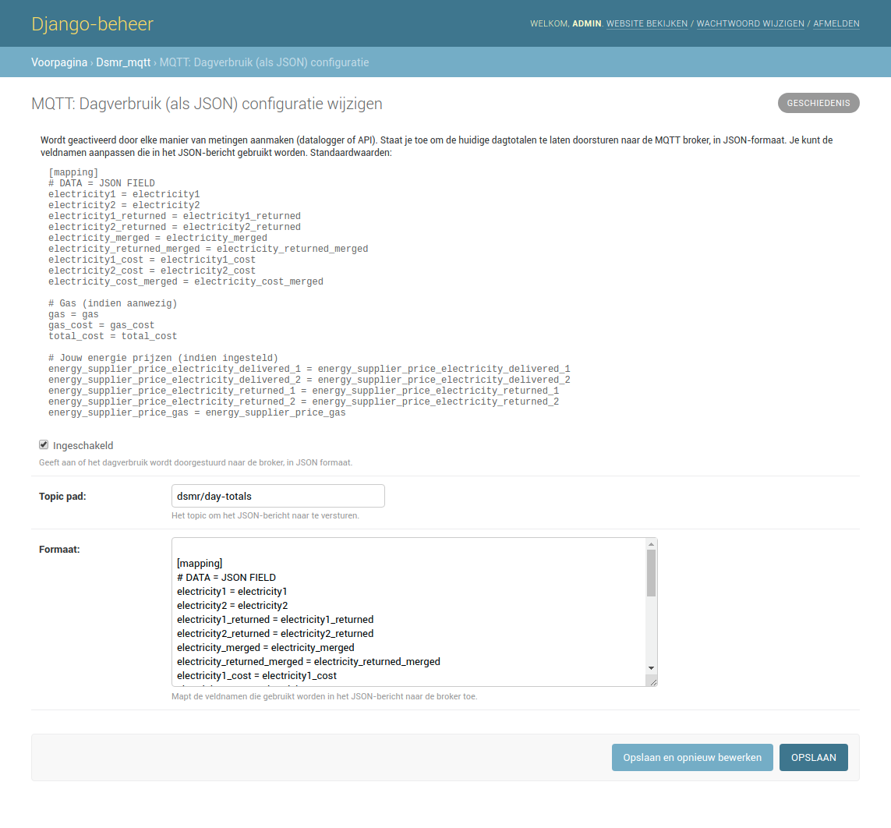
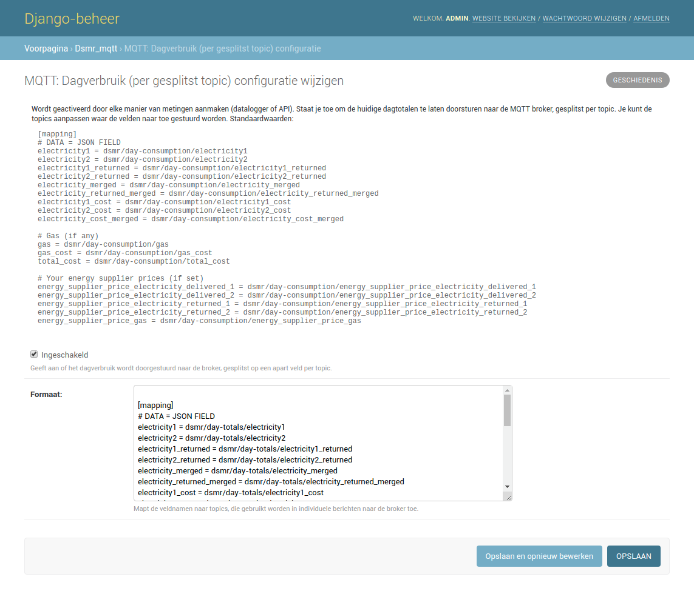
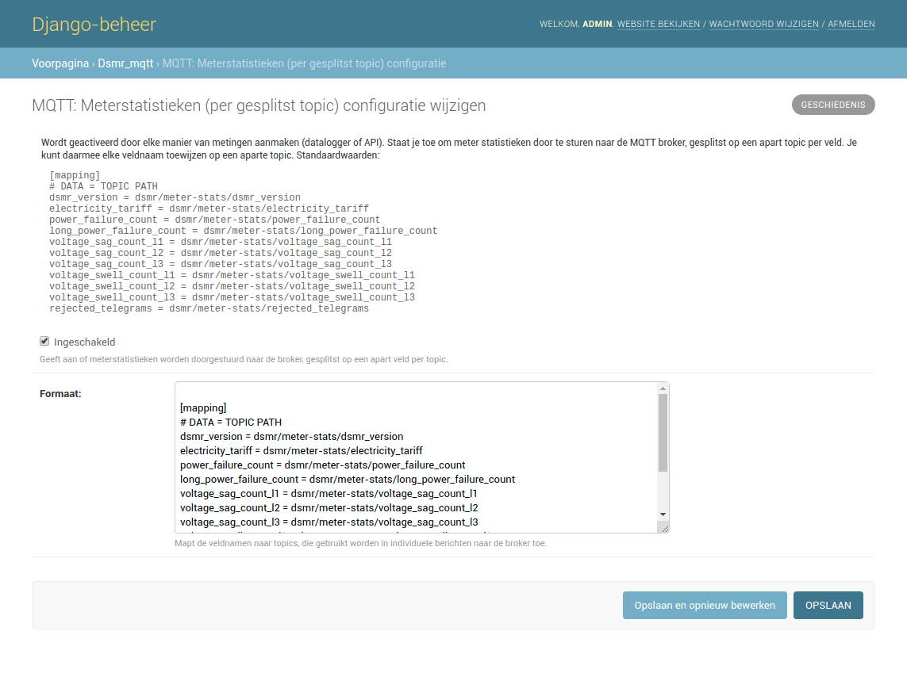
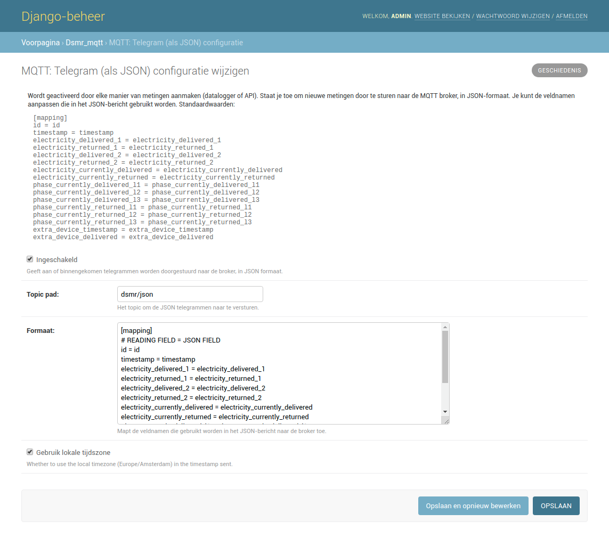
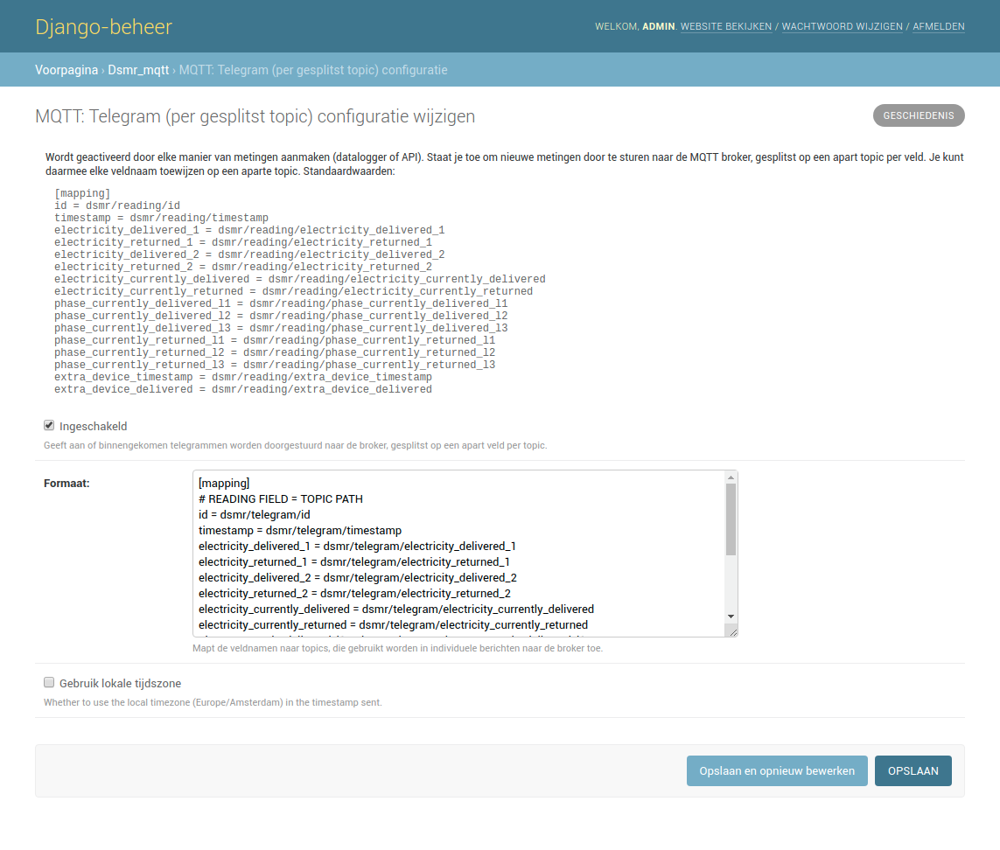
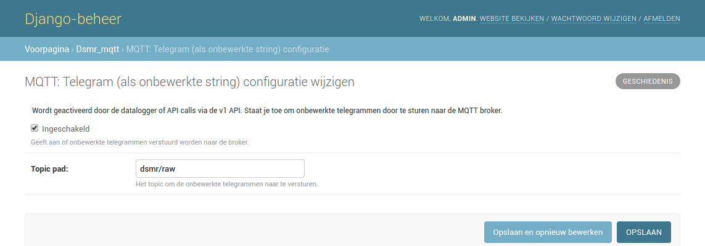

# MQTT

The application has native support for MQTT. In the screen displayed below you can enter all information about the broker you're using.

There are multiple configurations available for sending MQTT messages to your broker.
You can enable them separately, depending on your needs.
Many of these also allow you to define which fields are sent and how they should be identified in messages sent to the broker.

## Day totals

This allows you to receive the day totals in JSON format:

The same data, but split among topics. This allows you to post a single piece of data on a separate topic:

## Meter statistics

Statistics of your meter, split among topics:

## Telegram

Telegram in JSON format:

Or split among topics:

Or in raw DSMR protocol format (when available):

