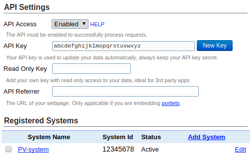
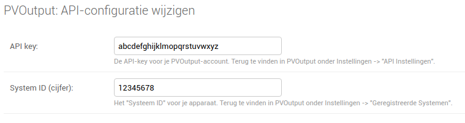
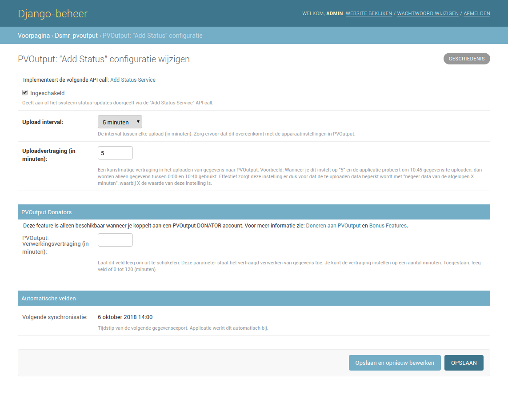

# PVOutput.org

!!! note "For your information"

    This is a feature using or integrating a **third party** and may or may not break along the years.

    Usually this depends on the third party supporting it and the amount of (re)work needed in DSMR-reader to keep it backward/forward compatible.

Make sure you have a [PVOutput.org](https://pvoutput.org) account, or signup for an account.
You will have to configure your account and PV system(s). For any support doing that, please [see this page](https://pvoutput.org/help.html#overview-getting-started) for more information.

In order to link DSMR-reader to your account, please write down the "API Key" and "System ID" from your PVOutput account. You can find them near the bottom of the "Settings" page in PVOutput.

Enter those values in DSMR-reader's admin pages, at "PVOutput: API configuration". Make sure to enter both:

- API Key
- System ID

    
Now navigate to another settings page in DSMR-reader: "PVOutput: "Add Status" configuration". 

* Enable uploading the consumption.
* Choose an interval between the uploads. You can configure this as well on the PVOutput's end, in Device Settings.
* Optionally, choose an upload delay X (in minutes). If set, DSMR-reader will not use data of the past X minutes. 
* Optionally, you can choose to enter a **processing delay in minutes** for PVOutput. Please note that PVOutput will only allow this when you have a **"Donation" account** on their website. If you do not have one, they will reject each API call you make, until you disable (clear) this option in DSMR-reader. 

If you configured everything correctly, you should see some additional data in PVOutput listed under "Your Outputs" momentarily.
