# About this project

What is DSMR-reader? What is its purpose? What are its goals?

## Project goals
- Provide a tool to easily extract, store and visualize data transferred by the DSMR protocol of your smart meter.
- Allow you to export your data to other systems or third parties.

**Data transfer protocol support**

- **MQTT**: Push data from DSMR-reader to a generic message broker.
- **REST API**: Push (telegram) data from a generic HTTP client to DSMR-reader.
- **REST API**: Pull data from DSMR-reader from a generic HTTP client.

Any integration should be possible this way, either using generic scripts or even **plugins**.

DSMR-reader only supports the built-in integrations mentioned above and, for practical reasons, cannot support every other (technical) integration that exists in the entire world.

## Architecture
<small>*Below is a very simplified schema of DSMR-reader's architecture.*</small> 
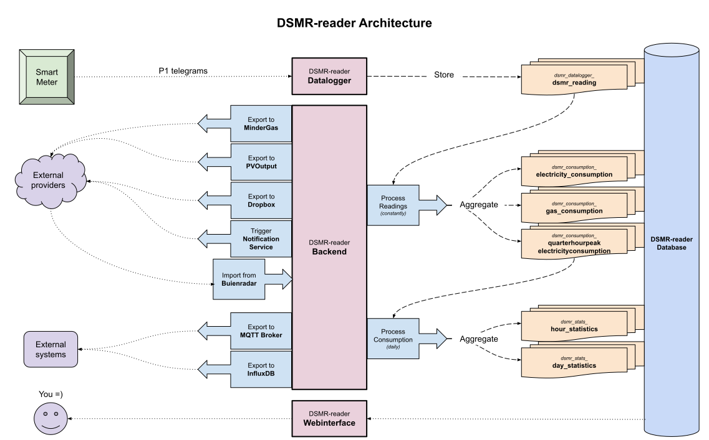

## Supported languages
- The entire application and its code is written and documented in **English**.
- The interface is available in both **English** and **Dutch**. <small>Detected by your browser's language preference</small>.
- Any [support and communication](https://github.com/dsmrreader/dsmr-reader/issues/new/choose) is available in both **English** and **Dutch**.
- This documentation is only available in **English**. 
 

## Hardware requirements

- RaspberryPi 5 (or similar) or better.
- P1 telegram cable or a network socket (when using ``ser2net``).
- A smart meter supporting any of these DSMR-telegram versions: ``v2`` / ``v4`` / ``v5``.

!!! danger "Heads up"

    Originally this project was built to run on SD-cards, but through the years it became clear that SD-cards are not reliable enough for this purpose.
    They will randomly and suddenly get corrupted, so be warned!

## Software requirements

- **OS**: Any operating system that supports (Docker) containers. DSMR-reader runs in a container to ease upgrading and reduce OS-wide dependencies.
- **Disk space**: 1+ GB - Depending on your smart meter and the amount of (source) readings you want to preserve.
- **Database**: A [supported](https://www.postgresql.org/support/versioning/) PostgreSQL database. <small>Other databases _may_ work as well, but are not supported for this project. Also note that this project is built with [Django Framework](https://www.djangoproject.com/), which determines which Database-versions are supported by DSMR-reader.</small>

## Screenshots

*Navigate using the tabs below.*

=== "Dashboard"

    The dashboard displays the latest information regarding the consumption of today.
    You can view the total consumption for the current month and year as well.
    
    If your meter supports it, you can also see your gas consumption and electricity returned.
    
    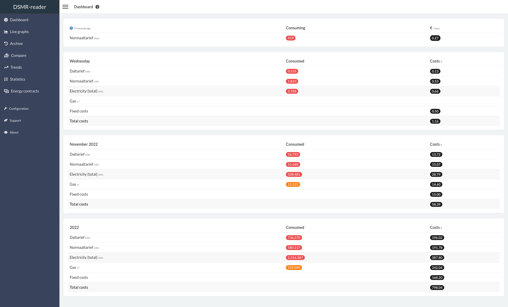

=== "Live graphs"

    The live graphs plots the most recent data available, depending on the capabilities of your smart meter.
    
    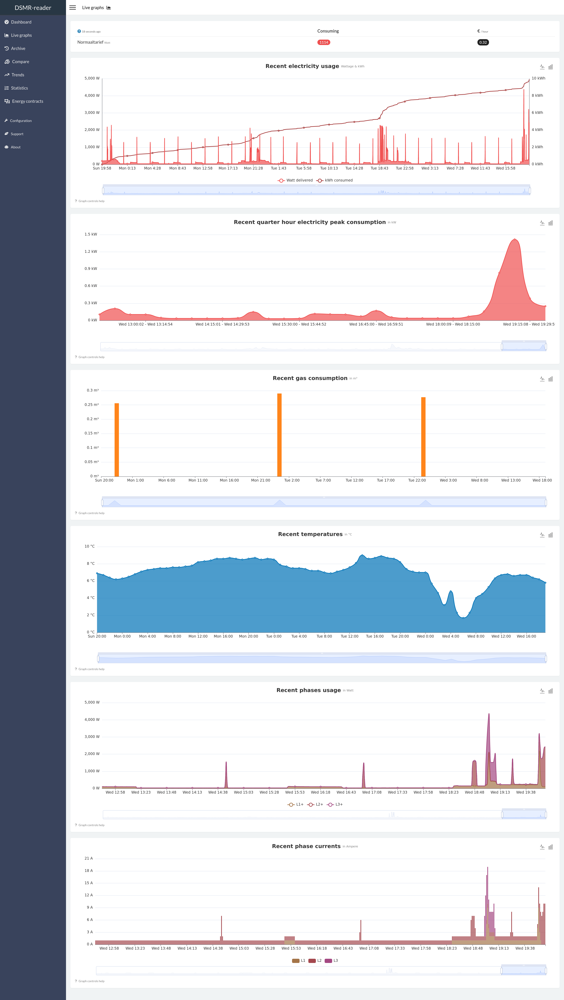

=== "Archive"

    The archive allows you to scroll through all historical data captured by the application.
    All data can be viewed on different levels: by day, by month and by year.
    
    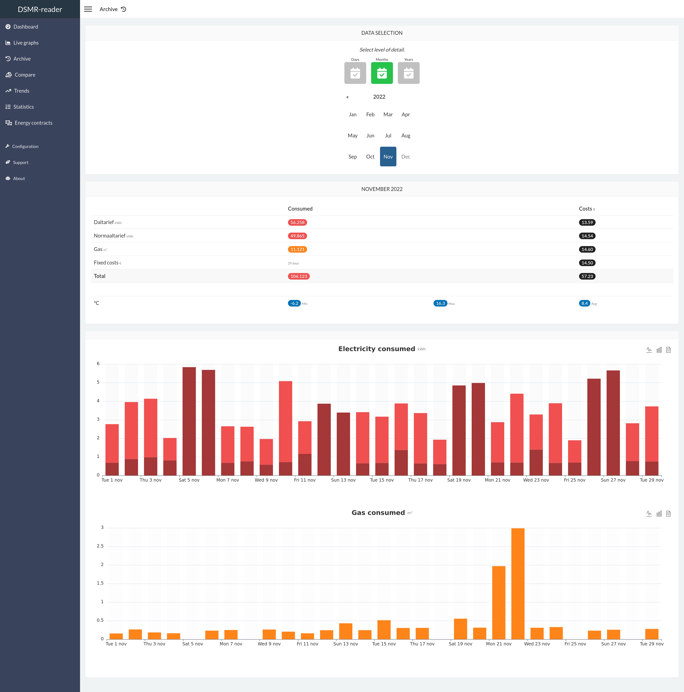

=== "Compare"
    
    This page allows you to simply compare two days, months or years with each other.
    It will also display the difference between each other as a percentage.
    
    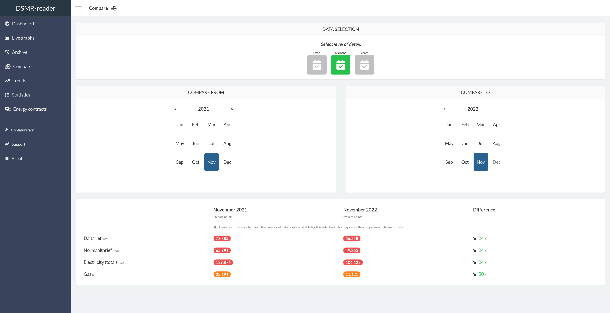

=== "Trends"
    
    This page displays a summary of your average daily consumption and habits.
    
    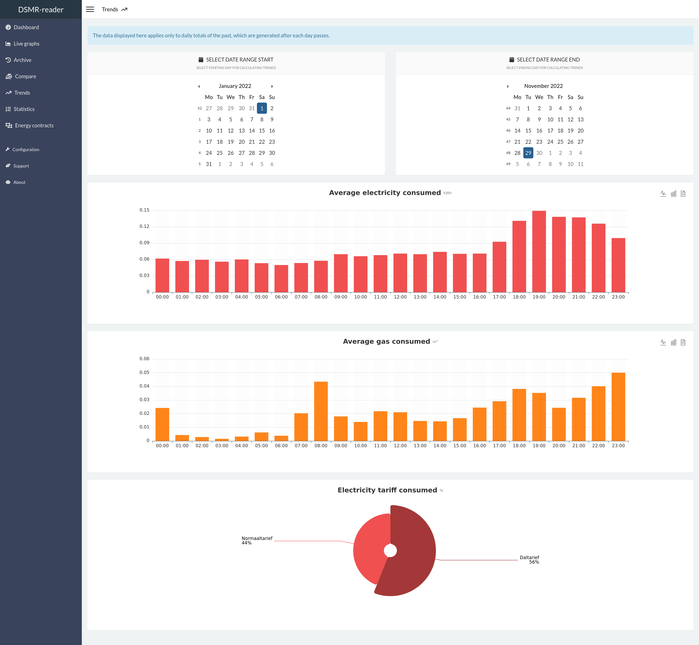

=== "Statistics"
    
    This page displays your meter positions and statistics provided by the DSMR protocol.
    You can also find the number of readings stored and any excesses regarding consumption.
    
    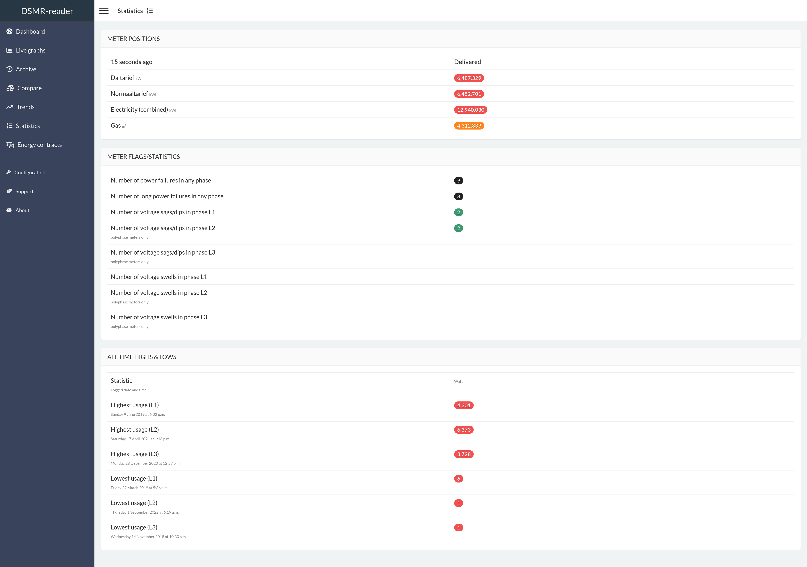

=== "Energy contracts"

    Summary of all your contracts and the amount of energy consumed/generated.
    
    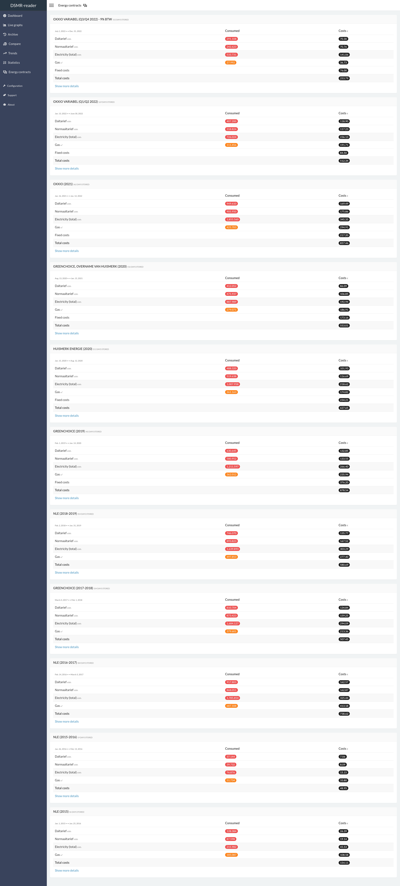

=== "Export"
    
    This pages allows you to export all day or hour statistics to CSV.
    
    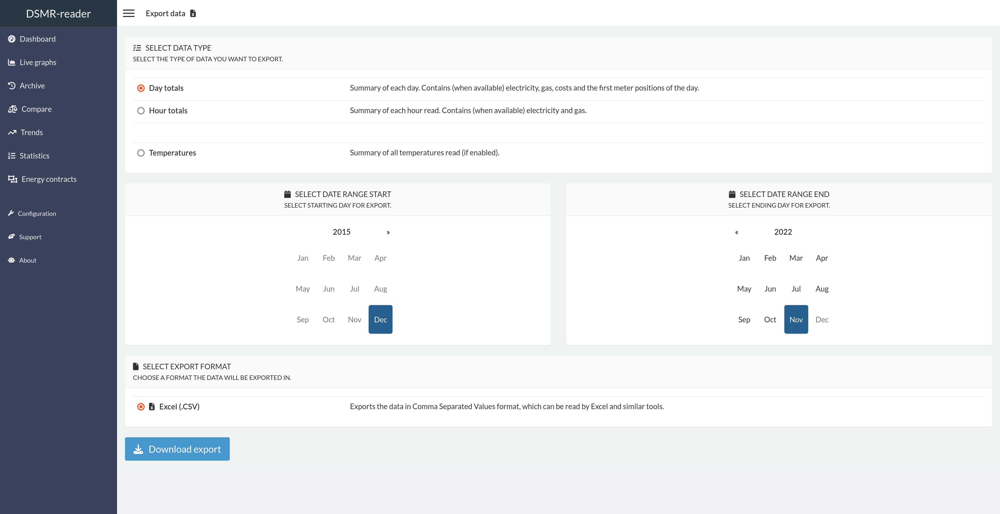

=== "About"
    
    Shows the 'health' of the application. Any issues will be reported here.
    You can also easily check for DSMR-reader updates here.
    
    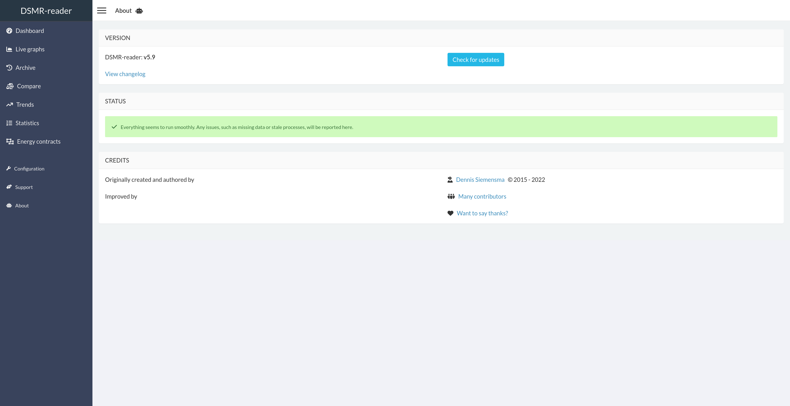

=== "Support"
    
    Assists you in finding the information required for debugging your installation or any issues.
    
    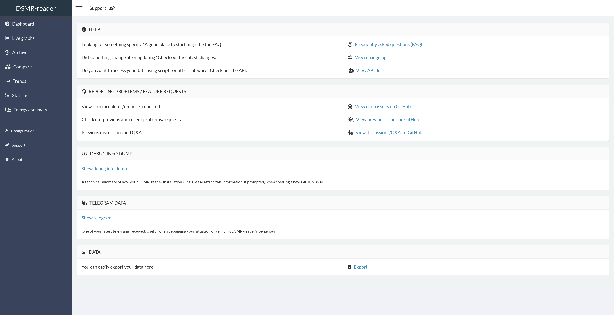

=== "Configuration"
    
    The configuration page is the entrypoint for the admin interface.
    
    You can type any topic or setting you're searching for, as it should pop up with clickable deeplink to the admin panel.
    Or you can just skip it this page and continue directly to the admin panel.
    
    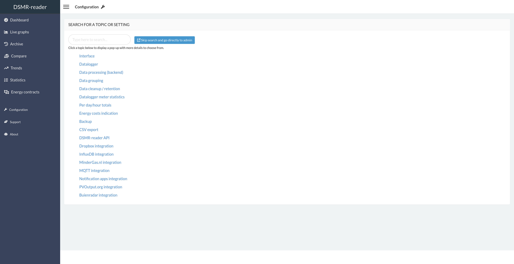
