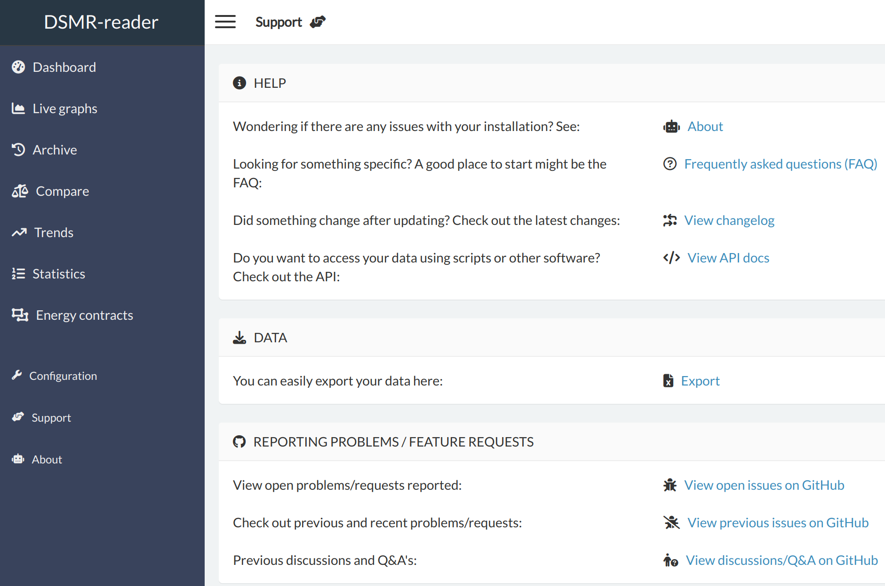
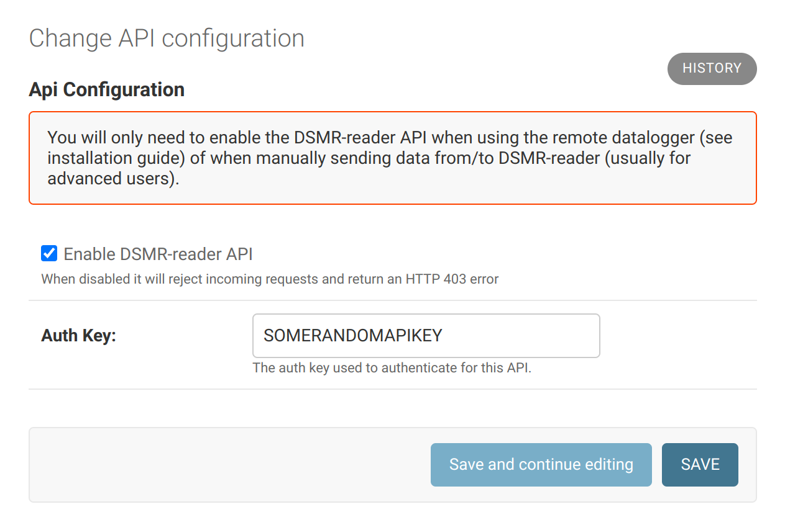

# REST API

The application has a REST API, allowing you to insert/create readings and retrieve statistics.

## Configuration
You can access the API documentation by selecting the **Support** menu item in DSMR-reader.

### Enable API
The API is **disabled** by default in the application. You may enable it in the **Configuration**.

## API key
A random API key is generated for you by default. You can always view or update it in the **Configuration**.
