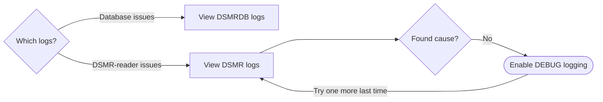

---
hide:
  - toc
---

# Logs and debugging



### DSMRDB logs

- To view the database logs, login as the `dsmrreader` user and run:

```shell title="shell"
podman-compose logs -f dsmrdb
# Press CTRL + C to stop following the logs

# Or when there are a lot of old logs, you can limit it to recent logs only:
podman-compose logs --since 30s -f dsmrdb
```

### DSMR logs

DSMR-reader technically consists of these processes:

| Process      | Description                                                                          |
|--------------|--------------------------------------------------------------------------------------|
| Backend      | Handles all background processing for everything that runs without user-interaction. |
| Datalogger   | Local datalogger reading telegrams (if used).                                        |
| Webinterface | Graphical interface of DSMR-reader.                                                  |

- To view the application logs, login as the `dsmrreader` user and run:

```shell title="shell"
sudo su - dsmrreader

podman-compose logs -f dsmr
# Press CTRL + C to stop following the logs

# Or when there are a lot of old logs, you can limit it to recent logs only:
podman-compose logs --since 30s -f dsmr
```

### DEBUG logging
By default, mostly errors are logged. You can enable DEBUG logging which will make **specifically** the DSMR backend log more information about what it's doing.

!!! tip "Heads up"

    Errors are likely to be logged at all times, no matter the logging level used.
    DEBUG logging is only helpful to watch DSMR-reader's detailed behaviour, when debugging issues.
    
    The DEBUG logging is **disabled by default**, to reduce the number writes on the filesystem.
    

You can enable the DEBUG logging by setting the `DSMRREADER_LOGLEVEL` env var to `DEBUG`. Follow these steps:

- Login as the `dsmrreader` user and edit the `compose.env` file:

```shell title="shell"
sudo su - dsmrreader
vi compose.env
```

```yaml title="compose.env" hl_lines="2"
# Only enable debug logging for DSMR-reader for troubleshooting as it LOGS A LOT.
DSMRREADER_LOGLEVEL=DEBUG
```

- Apply changes:

```shell title="shell"
podman-compose up -d
```

!!! warning "Caution"

    Don't forget to **disable** DEBUG logging again whenever you are done debugging.
